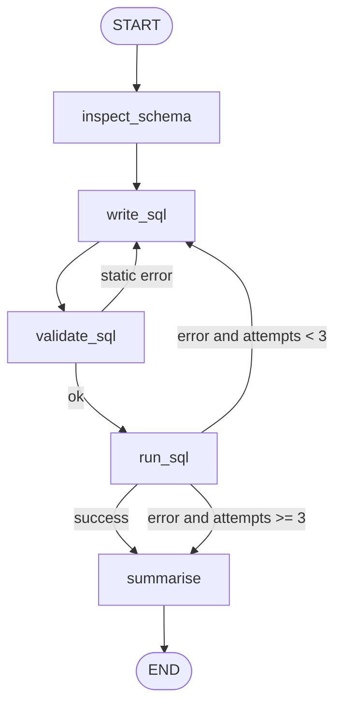

# 01 — SQL Data Analyst Agent

Turns a plain-English question into a **read-only SQL query**, runs it against SQLite, repairs the query if the database complains (up to 3 attempts), and explains the result.

**Pattern:** tool calling + self-correction loop · **Spec:** [guide/agents/01_sql_data_analyst.md](../../guide/agents/01_sql_data_analyst.md)



## Setup

**Windows (PowerShell)**

```powershell
cd agents_code\01_sql_data_analyst
python -m venv .venv
.\.venv\Scripts\Activate.ps1
python -m pip install --upgrade pip
pip install -r requirements.txt
copy .env.example .env
notepad .env        # paste your ANTHROPIC_API_KEY
```

**macOS / Linux**

```bash
cd agents_code/01_sql_data_analyst
python3 -m venv .venv
source .venv/bin/activate
python -m pip install --upgrade pip
pip install -r requirements.txt
cp .env.example .env
nano .env           # paste your ANTHROPIC_API_KEY
```

## Usage

```bash
# interactive session (creates sales.db with sample data on first run)
python agent.py

# one-shot question
python agent.py "Which 5 products had the highest revenue in the last 30 days?"

# use your own SQLite database
DB_PATH=/path/to/your.db python agent.py "How many customers signed up per region?"

# print the compiled graph (no API call)
python agent.py --graph
```

Example questions for the sample database (`products`, `customers`, `orders`):

- "Total revenue by category, highest first"
- "Average order value per region"
- "How many orders per month over the last 6 months?"
- "Delete all orders" → refused (read-only guardrail)

## What to look at

| Spec section | In `agent.py` |
|---|---|
| State schema | `class State` — `attempts` uses `operator.add` so the loop counter is reducer-driven |
| Tools | `get_schema`, `execute_sql` — read-only URI connection and a SELECT/WITH check |
| Guardrails | `validate_sql` (static regex), `execute_sql` (second layer), `NOT_A_DATA_QUESTION` refusal |
| Loop limit | `after_run` router, `MAX_ATTEMPTS = 3` |

## Swapping in a real database

Replace `get_schema` and `execute_sql` with your driver (psycopg, SQLAlchemy…). Keep the contract: return `{"rows": [...]}` or `{"error": "..."}` and never raise — the repair loop depends on it.
