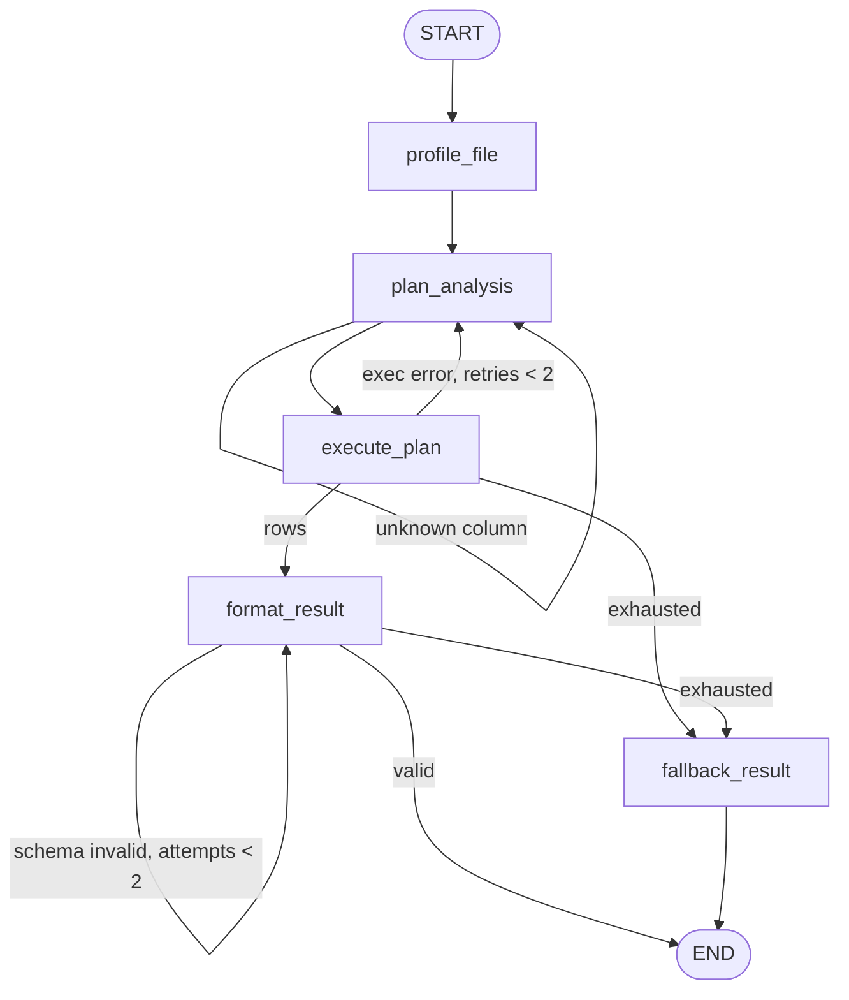

# 02 - CSV/Excel Data Analyst Agent

Drop a CSV / Excel / Parquet file, ask a question, get back a **validated `AnalysisResult`** (summary, table, optional chart spec, caveats, the pandas expression used). The model never touches the file: it writes one pandas expression, a sandboxed tool evaluates it.

**Pattern:** file-based tools + structured output - **Spec:** [guide/agents/02_csv_excel_data_analyst.md](../../guide/agents/02_csv_excel_data_analyst.md)



## Setup

**Windows (PowerShell)**

```powershell
cd agents_code\02_csv_excel_data_analyst
python -m venv .venv
.\.venv\Scripts\Activate.ps1
python -m pip install --upgrade pip
pip install -r requirements.txt
copy .env.example .env      # paste your ANTHROPIC_API_KEY
```

**macOS / Linux**

```bash
cd agents_code/02_csv_excel_data_analyst
python3 -m venv .venv
source .venv/bin/activate
python -m pip install --upgrade pip
pip install -r requirements.txt
cp .env.example .env        # paste your ANTHROPIC_API_KEY
```

## Usage

```bash
# interactive, on the auto-generated sample_sales.csv
python agent.py

# one-shot
python agent.py "Average order amount by region"

# your own file (csv / xlsx / xls / parquet)
python agent.py --file data/q2.xlsx --sheet Orders "Top 10 products by total amount"

# graph only, no API call
python agent.py --graph
```

Example questions for the sample file (`order_id, region, product, amount, discount, order_date, customer_email`):

- "How many orders and what is the total amount?"
- "Which product has the highest average discount?"  (note the caveat: `discount` has ~12 % nulls)
- "Orders per month"

## What to look at

| Spec section | In `agent.py` |
|---|---|
| Structured output | `AnalysisResult` Pydantic model + `llm.with_structured_output(...)` |
| Sandbox | `run_pandas`: denylist regex + `eval` with empty builtins and only `df`, `pd`, `np` |
| PII | `profile_table` redacts sample values of `email/phone/ssn/...` columns |
| Column check | `plan_analysis` rejects quoted identifiers that are not real columns before execution |
| Retry caps | `exec_retries < 2`, `format_attempts < 2`, then `fallback_result` |

## Using it as a library

```python
from agent import analyse
result = analyse("sales.csv", "Total amount by region")
print(result["summary"], result["table"])
```
