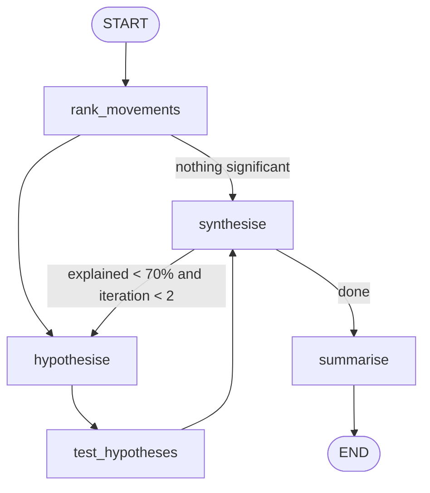

# 03 - BI Dashboard Insights Agent

Reads a set of dashboard metrics (current vs prior period), ranks the biggest movements **in code**, asks the model which dimensions might explain each one, tests those hypotheses with a breakdown tool, computes explained share and confidence **in code**, loops once more for anything under 70 % explained, then writes a 180-word executive narrative.

**Pattern:** multi-step reasoning + summariser node - **Spec:** [guide/agents/03_bi_dashboard_insights.md](../../guide/agents/03_bi_dashboard_insights.md)



## Setup

**Windows (PowerShell)**

```powershell
cd agents_code\03_bi_dashboard_insights
python -m venv .venv
.\.venv\Scripts\Activate.ps1
python -m pip install --upgrade pip
pip install -r requirements.txt
copy .env.example .env      # paste your ANTHROPIC_API_KEY
```

**macOS / Linux**

```bash
cd agents_code/03_bi_dashboard_insights
python3 -m venv .venv
source .venv/bin/activate
python -m pip install --upgrade pip
pip install -r requirements.txt
cp .env.example .env        # paste your ANTHROPIC_API_KEY
```

## Usage

```bash
python agent.py                               # runs on data/metrics.json + data/breakdowns.json
python agent.py --audience "CFO"              # changes the narrative's reader
python agent.py --metrics my_metrics.json     # your own snapshot (same shape as data/metrics.json)
python agent.py --graph                       # diagram only
```

Expected output on the sample data: revenue +12.7 % driven by Paid Social, refund_rate +38 % almost entirely Footwear, sessions -4 % driven by the East region, and a short narrative ending with a follow-up question.

## Data format

`data/metrics.json` - the dashboard snapshot:

```json
{"period_label": "...", "dimensions": ["region", "channel"],
 "metrics": [{"name": "revenue", "current": 1240000, "prior": 1100000, "unit": "USD"}]}
```

`data/breakdowns.json` - what the `dimension_breakdown` tool returns: `metric -> dimension -> [{value, current, prior}]`. Replace `dimension_breakdown()` with a warehouse query to go live.

## What to look at

| Spec section | In `agent.py` |
|---|---|
| Deterministic ranking | `rank_movements` - no LLM, reproducible |
| Closed world | `hypothesise` filters model output to real dimensions/metrics; `synthesise` never invents numbers |
| Reducers | `hypotheses` and `driver_evidence` use `operator.add`, so re-entry appends |
| Iteration cap | `after_synthesise`: `MAX_ITER = 2` |
| Tool failure | unknown breakdown -> hypothesis marked `testable: False`, confidence lowered, run continues |
