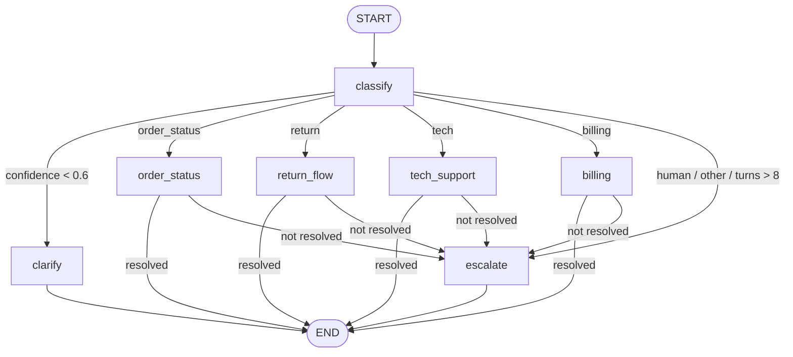

# 04 - Customer Support Agent

First-line support chat that **classifies intent, routes to a specialist path** (order status, returns, tech troubleshooting, billing) and escalates to a human with a handoff packet when it can't help. Conversation history is checkpointed per `thread_id`, so a clarifying question ends the run and the next message picks up where it left off.

**Pattern:** router / conditional edges by intent - **Spec:** [guide/agents/04_customer_support.md](../../guide/agents/04_customer_support.md)



## Setup

**Windows (PowerShell)**

```powershell
cd agents_code\04_customer_support
python -m venv .venv
.\.venv\Scripts\Activate.ps1
python -m pip install --upgrade pip
pip install -r requirements.txt
copy .env.example .env      # paste your ANTHROPIC_API_KEY
```

**macOS / Linux**

```bash
cd agents_code/04_customer_support
python3 -m venv .venv
source .venv/bin/activate
python -m pip install --upgrade pip
pip install -r requirements.txt
cp .env.example .env        # paste your ANTHROPIC_API_KEY
```

## Usage

```bash
python agent.py                              # chat as customer C-4471
python agent.py --customer anon              # unknown customer (billing -> escalate)
python agent.py --thread ticket-42           # separate conversation thread
python agent.py --graph
```

Sample data lives at the top of `agent.py`: orders `88213` (in transit), `77120` (delivered 10 days ago, returnable), `65001` (another customer's, 100 days old), a 3-entry knowledge base, and invoices for `C-4471`.

Things to try:

| You type | What happens |
|---|---|
| `My order 88213 still hasn't arrived` | `order_status` - reply built only from the tool result |
| `I want to return 77120` | `return_flow` - eligibility check, then an RMA number |
| `Return order 65001` | not on your account -> polite "can't find it" |
| `My speaker won't pair` | `tech_support` - numbered steps citing KB titles |
| `I want a refund now` | `billing` refuses refund authority -> `escalate` with handoff JSON |
| `It's broken` | low confidence -> one clarifying question; answer it on the next turn |
| `My card is 4111 1111 1111 1234` | masked to `****1234` before it enters state |

## What to look at

| Spec section | In `agent.py` |
|---|---|
| Router | `route_intent` reads `intent`, `intent_confidence`, `turns` - no LLM in the router |
| Checkpointing | `build_graph(checkpointer=InMemorySaver())`, `thread_id` in `config`; `clarify -> END` then resume next turn |
| Guardrails | `mask_cards`, `MAX_TURNS`, refund authority in `billing`, tool-only facts in reply prompts |
| Handoff | `escalate` uses structured output -> `Escalation(reply, summary, sentiment)` |

To persist threads across restarts, replace `InMemorySaver()` with `SqliteSaver` (see agent 06 for the pattern).
