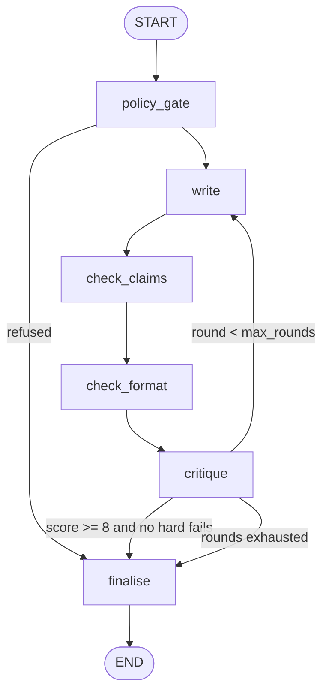

# 07 - Marketing Content Agent

A two-persona studio in one graph: a **writer** drafts copy from a brief, a **claim checker** and a **format checker** flag unsupported facts, banned words and length overruns, and an **editor** scores the draft and sends notes back. The loop runs up to `max_rounds`, and `finalise` picks the best-scoring draft from history - not necessarily the last one.

**Pattern:** generate -> critique -> revise - **Spec:** [guide/agents/07_marketing_content.md](../../guide/agents/07_marketing_content.md)



## Setup

**Windows (PowerShell)**

```powershell
cd agents_code\07_marketing_content
python -m venv .venv
.\.venv\Scripts\Activate.ps1
python -m pip install --upgrade pip
pip install -r requirements.txt
copy .env.example .env      # paste your ANTHROPIC_API_KEY
```

**macOS / Linux**

```bash
cd agents_code/07_marketing_content
python3 -m venv .venv
source .venv/bin/activate
python -m pip install --upgrade pip
pip install -r requirements.txt
cp .env.example .env        # paste your ANTHROPIC_API_KEY
```

## Usage

```bash
python agent.py                                       # email launch brief, 3 rounds max
python agent.py --brief data/brief_social.json        # 280-char social post
python agent.py --rounds 1                            # see the first draft's critique only
python agent.py --graph
```

Output shows one line per round (score, hard fails, first notes), then `passed=True/False` and the final copy.

`data/brief.json` fields: `product, audience, channel (email|social|landing), goal, key_points[], cta`.
`data/brand_guide.json` fields: `voice, banned_words[], tagline`.

## What to look at

| Spec section | In `agent.py` |
|---|---|
| Two personas | `write` (writer prompt) and `critique` (editor prompt) - the editor is told never to rewrite |
| Claim grounding | `check_claims`: model extracts claims, code diffs them against `key_points` (numbers must match a key point) |
| Code-enforced rules | `check_format`: channel length limits + banned-word regex, no model involved |
| Loop + best-of-history | `history` and `round` use `operator.add`; `finalise` takes `max()` over history |
| Content policy | `policy_gate` refuses restricted briefs before any drafting |

Try adding `"50% brighter than competitors"` to the writer's output by putting it in the brief's `goal` (not `key_points`) - the claim checker should flag it as a hard fail and the next round should drop it.
