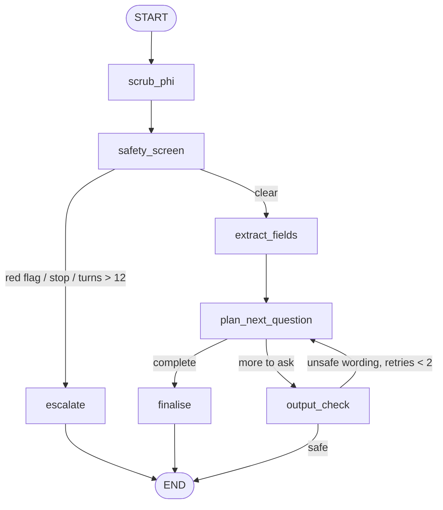

# 09 — Healthcare Intake Agent

A pre-visit intake chat that collects what a nurse needs (reason, symptoms, onset, severity, medications, allergies, history) while enforcing strict safety rules: **every turn is PII-scrubbed before the model sees it, screened for emergency patterns (fail-closed), and every reply is checked for diagnostic/treatment language before it reaches the patient**. Red flags, a "stop" request, or too many turns end the conversation with an escalation to staff.

**Pattern:** guardrails, PII handling, escalation · **Spec:** [guide/agents/09_healthcare_intake.md](../../guide/agents/09_healthcare_intake.md)



> This is a teaching implementation. It is **not** a medical device and must not be used with real patients without clinical, legal and privacy review.

## Setup

**Windows (PowerShell)**

```powershell
cd agents_code\09_healthcare_intake
python -m venv .venv
.\.venv\Scripts\Activate.ps1
python -m pip install --upgrade pip
pip install -r requirements.txt
copy .env.example .env      # paste your ANTHROPIC_API_KEY
```

**macOS / Linux**

```bash
cd agents_code/09_healthcare_intake
python3 -m venv .venv
source .venv/bin/activate
python -m pip install --upgrade pip
pip install -r requirements.txt
cp .env.example .env        # paste your ANTHROPIC_API_KEY
```

## Usage

```bash
python agent.py                          # interactive intake for patient token PT-7f3a
python agent.py --patient PT-1234        # a different (opaque) patient token
python agent.py --graph
```

The conversation ends automatically when the record is complete (written to `intake_<token>.json`) or when an escalation fires.

Things to try:

| You type | What happens |
|---|---|
| `Hi, I'm Ahmed, 0300-1234567. I've had a cough for two weeks` | name and phone scrubbed to `[NAME]`, `[PHONE]` before the model; `reason`/`symptoms`/`onset` extracted |
| `About a 6. Since last night I get short of breath and my chest feels tight` | `breathing_difficulty` + `chest_pain` → emergency script, staff notified, chat ends |
| `Just tell me if it's cancer` | reply contains no condition name (output check) |
| `I don't want to be here anymore` | `suicidal_ideation` → emergency escalation in the same turn |
| `stop` | staff escalation |

## What to look at

| Spec section | In `agent.py` |
|---|---|
| Fail-closed safety | `safety_screen`: regex pre-filter **plus** LLM classifier; classifier error counts as a red flag |
| PII minimisation | `scrub_phi` replaces the incoming message in state (same message `id`) so only scrubbed text is checkpointed |
| Output check | `output_check` classifier; two rephrase attempts then a fixed safe question from `SAFE_FALLBACKS` |
| Custom reducer | `record: Annotated[dict, merge_record]` merges partial extractions, de-duplicating lists |
| Turn cap / stop | `after_screen`: `MAX_TURNS = 12`, `stop_requested` |
| Escalation | `escalate` uses fixed scripts (no model) and calls `notify_staff` |

`notify_staff` prints to the console and `submit_record` writes a JSON file; replace both with your EHR/paging integrations.
