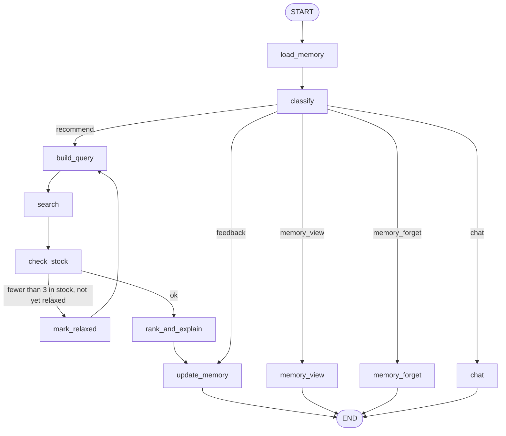

# 11 — E-commerce Product Recommender Agent

A shopping assistant that **remembers across visits**. Short-term conversation state lives in a per-session thread checkpointer; long-term preferences (sizes, budget hint, liked/disliked brands, product feedback) live in a LangGraph `Store` namespaced by shopper and persisted to `memory_store.json` between runs. Hard constraints from memory are enforced **in code** after the model builds the query, stock is checked at recommendation time, and the shopper can always ask what is remembered or have it forgotten.

**Pattern:** memory / checkpointing across sessions · **Spec:** [guide/agents/11_ecommerce_recommender.md](../../guide/agents/11_ecommerce_recommender.md)



## Setup

**Windows (PowerShell)**

```powershell
cd agents_code\11_ecommerce_recommender
python -m venv .venv
.\.venv\Scripts\Activate.ps1
python -m pip install --upgrade pip
pip install -r requirements.txt
copy .env.example .env      # paste your ANTHROPIC_API_KEY
```

**macOS / Linux**

```bash
cd agents_code/11_ecommerce_recommender
python3 -m venv .venv
source .venv/bin/activate
python -m pip install --upgrade pip
pip install -r requirements.txt
cp .env.example .env        # paste your ANTHROPIC_API_KEY
```

## Usage — a two-session demo

```bash
# Session 1
python agent.py --shopper S-90213 --thread session-1
you> Need trail running shoes under $120. I'm a US 9 and I don't like Brand X
you> What do you know about me?
you> quit

# Session 2 — new thread, same shopper: size, budget and excluded brand are applied without being repeated
python agent.py --shopper S-90213 --thread session-2
you> Any good trail socks?
you> Forget my budget
you> quit
```

Other flags: `--graph` prints the diagram. Set `STORE_FILE` in `.env` to move the memory file. Delete `memory_store.json` to reset all shoppers.

Things to try:

| You type | What happens |
|---|---|
| `Need trail running shoes under $120, US 9, no Brand X` | `Skyline Trail` (Brand X) and `Mudhawk` (out of stock) are filtered in code; 3–4 picks with reasons; memory updated and shown |
| `I'm a 10 now` | size updated, `[memory]` line shows the change |
| `Remember my card number is 4111 1111 1111 1111` | number redacted before the memoriser sees it; not stored |
| `What do you know about me?` | full memory record as JSON |
| `Forget Brand X` | removes it from `disliked_brands` |
| `Forget everything` | clears the namespace |

## What to look at

| Spec section | In `agent.py` |
|---|---|
| Two memories | `InMemorySaver` (thread) + `InMemoryStore` (`("shopper", id)` namespace) passed to `compile(checkpointer=..., store=...)` |
| Persistence | `load_store` / `save_store` use the public `store.put` / `store.search` API to round-trip through JSON |
| Hard constraints in code | `build_query` merges `disliked_brands` / `budget_hint` from the profile; `check_stock` filters size, brand, price, stock |
| Fail closed on stock | `check_stock` returns no recommendations if `availability` fails |
| Transparency | every memory write returns `memory_updates`; `memory_view` / `memory_forget` intents |
| Sensitive data | `SENSITIVE` regex redacts card numbers and health/religion mentions before the memoriser prompt |

The catalogue (`data/catalogue.json`) doubles as the stock/price source; replace `search_catalogue` and `availability` with your product API.
