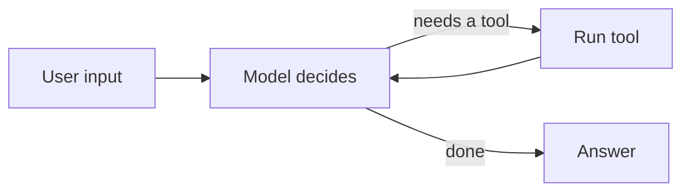

# Module 00 — Setup & Mental Model

*Time: 30 min · Prerequisite: basic Python*

## What you will be able to do after this module

- Install LangGraph and connect to an LLM
- Say in one sentence what an "agent" is
- Tell the difference between a chain and an agent
- Know what the next 11 modules build toward

> 🎤 Talking points
> Set expectations: this module is 80 % concepts and 20 % terminal. Nobody builds a graph today. The goal is a shared vocabulary and a working environment so Module 01 and 02 can go fast.

## Install in three commands

```bash
python -m venv .venv && source .venv/bin/activate   # Windows: .venv\Scripts\activate
pip install -U langgraph langchain langchain-anthropic
export ANTHROPIC_API_KEY=sk-ant-...                 # Windows: setx ANTHROPIC_API_KEY sk-ant-...
```

- `langgraph` — the graph engine
- `langchain` — model wrappers, tool decorator, message types
- `langchain-anthropic` — the Claude connector (swap for your provider)

> 🎤 Talking points
> Have everyone run these now. The most common failure is the API key not being visible to the terminal that runs Python — restart the terminal after `setx` on Windows.

## Smoke test: talk to the model

```python
from langchain_anthropic import ChatAnthropic
llm = ChatAnthropic(model="claude-sonnet-5")
print(llm.invoke("Say hello in five words.").content)
```

- If this prints a sentence, you are set up
- `invoke` sends one request and returns one response
- `.content` is the text; the object also carries metadata

> 🎤 Talking points
> This is the *only* thing LangChain does for us in the course: a uniform way to call a model. Everything interesting happens in LangGraph.

## What is an LLM call, really?

- Input: a list of messages (system, human, AI)
- Output: one AI message
- No memory: the model forgets everything between calls
- No hands: the model cannot look anything up or run anything
- Everything else — memory, tools, multi-step reasoning — is **code we write around the model**

> 🎤 Talking points
> This is the key mental shift. Beginners think the model "does things". It does not. It reads text and writes text. An *agent* is the program that gives the model memory and hands.

## Chain vs agent

| | Chain | Agent |
|---|---|---|
| Steps | Fixed in advance | Chosen at runtime |
| Loops | No | Yes |
| Uses tools | Maybe, in a fixed spot | Whenever the model decides |
| Example | "Summarise → translate" | "Answer this question using search and a calculator" |

- A chain is a pipeline. An agent is a **loop with decisions**.

> 🎤 Talking points
> Draw the two on the whiteboard: a straight line vs a circle with an exit. Ask: "What happens when the model needs to search twice?" A chain cannot; an agent can.

## Definition we will use

**An agent = a model + tools + a loop that decides what to do next.**

- The model *proposes* (call a tool, answer, ask a question)
- Your code *executes* the proposal and feeds the result back
- The loop ends when the model says it is done, or your code says enough

> 🎤 Talking points
> Every agent framework is a variation on this sentence. LangGraph's variation: the loop is an explicit graph you can draw, inspect, pause, and resume.

## The basic agent loop



- This picture is the whole course in one diagram
- LangGraph gives each box a name (node) and each arrow a rule (edge)

> 🎤 Talking points
> Keep this diagram on the wall. In Module 04 the students build exactly this. In Module 08 they nest it inside bigger graphs.

## Where the course goes

1. Modules 01–03: build a graph with no tools at all
2. Modules 04–05: give it tools and decisions
3. Modules 06–07: memory and human approval
4. Modules 08–10: many agents, streaming, safety, deployment
5. Module 11: rebuild four real-world agents from specs

> 🎤 Talking points
> Point out that the first three modules deliberately avoid tools. Students who understand state before tools have far fewer bugs later.

## Recap

- An LLM call is stateless text-in, text-out; everything else is code around it.
- A chain is a fixed pipeline; an agent is a loop where the model decides the next step.
- LangGraph makes that loop an explicit, drawable graph.

## Exercise

Write a plain Python `while` loop (no LangGraph) that asks the model a question, and if the reply contains the word `SEARCH:`, prints "would search for …" and asks the model again with the fake result "no results found". Stop when the reply has no `SEARCH:`.

*Hint:* you only need `llm.invoke`, a string check, and a counter so the loop cannot run forever.

## Common mistakes

- Expecting the model to remember the previous call — it does not; you must pass history in.
- Installing `langchain` but forgetting the provider package (`langchain-anthropic`).
- Setting the API key in one terminal and running Python in another.
