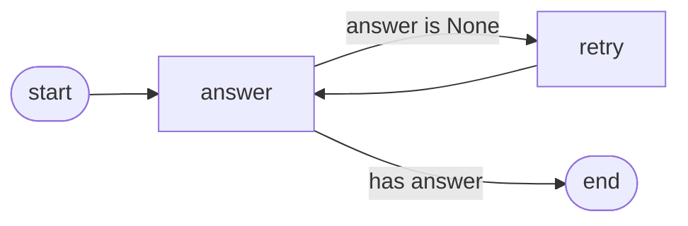

# Module 01 — Why LangGraph

*Time: 30 min · Builds on: Module 00*

## What you will be able to do after this module

- Explain why a hand-written loop breaks down as agents grow
- Define State, Node, and Edge in your own words
- Read a LangGraph diagram and predict what runs when

> 🎤 Talking points
> Still no code today beyond a tiny sketch. This module earns the framework: students should leave *wanting* a graph because they felt the pain of the loop.

## The loop from Module 00 grows up

Imagine the exercise loop, six months later:

- Two tools instead of one
- "If the tool fails twice, ask the user"
- "Before sending an email, get manager approval"
- "Save progress so a crash does not lose the conversation"
- "Let me see exactly which step is running"

> 🎤 Talking points
> Ask the room: where in a `while` loop do you put "pause and wait for a manager, possibly for two days"? There is no good answer. That is the problem LangGraph solves.

## What goes wrong with the plain loop

- Control flow is buried in `if`/`elif` chains nobody can draw
- Pausing means saving Python locals — fragile and ad hoc
- Retries, limits, and branches all mutate the same variables
- Testing one step means running the whole loop
- Two people cannot work on two steps without conflicts

> 🎤 Talking points
> Each bullet maps to a LangGraph feature we will meet: drawable graphs, checkpointing, reducers, node-level testing, subgraphs. Do not name them yet — just plant the pain.

## The idea: make the loop a graph

- Every step becomes a **Node** — a plain function
- Every "what happens next" becomes an **Edge** — a plain rule
- Everything the steps share becomes **State** — a plain dict
- The framework runs the graph: it calls nodes, follows edges, saves state

> 🎤 Talking points
> Emphasise "plain": plain function, plain rule, plain dict. LangGraph adds structure, not magic. Anyone who can write a function can write a node.

## State — the shared whiteboard

- One dictionary that every node can read
- Nodes do not talk to each other; they write on the whiteboard
- You declare its shape up front (which keys, which types)
- The graph hands the current state to each node and merges what it returns

```python
state = {"question": "What is 2+2?", "answer": None, "attempts": 0}
```

> 🎤 Talking points
> The whiteboard metaphor pays off for the rest of the course. "Who wrote this key?" is always answerable. Contrast with the loop where variables leak everywhere.

## Node — one job, one function

- Takes the state, returns the **changes** it wants to make
- Does not return the whole state — only the keys it updates
- Can call a model, call a tool, or just do plain Python

```python
def answer(state):
    return {"answer": "4", "attempts": state["attempts"] + 1}
```

> 🎤 Talking points
> "Returns only the changes" surprises people. Show that this makes nodes small and independently testable: call `answer({...})` directly, assert on the dict.

## Edge — what runs next

- **Normal edge:** after node A, always run node B
- **Conditional edge:** after node A, look at the state and pick B or C
- Special names for the beginning and end of the graph
- Edges are declared once, up front — the graph is a picture you can print



> 🎤 Talking points
> Notice the loop is now visible as an arrow going back. In the `while` version it was invisible. Being able to *see* the loop is the whole value proposition.

## The graph engine's job

1. Start at the entry point with the initial state
2. Run the current node, merge its returned changes into state
3. Follow the edge (or evaluate the condition) to find the next node
4. Repeat until the end node
5. Optionally save state after every step so you can pause or resume

> 🎤 Talking points
> Step 5 is where checkpointing and human approval come from — Modules 06 and 07. Because state is a dict and every step is recorded, "pause for two days" becomes trivial.

## Vocabulary card

| Word | Means | Python shape |
|---|---|---|
| State | shared data | a typed dict |
| Node | one step | a function `state -> partial state` |
| Edge | what comes next | a declaration, or a function `state -> node name` |
| Graph | all of the above, compiled | an object you call `invoke` on |

> 🎤 Talking points
> Have students copy this table. It is the entire mental model; every later module adds detail to one row.

## Recap

- Hand-written agent loops hide control flow, cannot pause well, and are hard to test.
- LangGraph makes the loop explicit: State (shared dict), Nodes (functions returning changes), Edges (next-step rules).
- Because every step is recorded, pausing, resuming, and inspecting come for free.

## Exercise

On paper (or in a text file), design a graph for this task: "Read a support email, decide if it is a refund request, and if so draft a reply; otherwise label it for a human." List the state keys, the nodes, and the edges, and draw the diagram with a loop for "draft was too long, shorten it".

*Hint:* you need at most 4 nodes and one conditional edge; the loop is an arrow back to the drafting node.

## Common mistakes

- Thinking a node must return the whole state — it returns only the keys it changes.
- Putting decision logic inside a node instead of on an edge — the graph becomes un-drawable again.
- Trying to pass data between nodes directly — everything goes through state.
