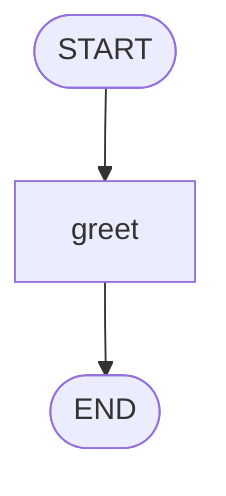

# Module 02 — Your First Graph

*Time: 40 min · Builds on: Modules 00–01*

## What you will be able to do after this module

- Declare a state with `TypedDict`
- Build a `StateGraph`, add nodes and edges, compile it
- Run it with `invoke` and read the result
- Draw the graph LangGraph actually built

> 🎤 Talking points
> Today is hands-on. Everyone types every line. The graph is deliberately boring — no model at first — so the only new thing is the API.

## Step 1 — declare the state

```python
from typing import TypedDict

class State(TypedDict):
    name: str
    greeting: str
```

- `TypedDict` is a dict with declared keys and types
- This is the "shared whiteboard" from Module 01
- Nodes read from it and return pieces of it

> 🎤 Talking points
> `TypedDict` is plain Python (`typing` module). LangGraph uses the annotations to know which keys exist. Module 03 adds one more trick to these annotations; for now, plain types.

## Step 2 — write a node

```python
def greet(state: State) -> dict:
    return {"greeting": f"Hello, {state['name']}!"}
```

- A node is a function: state in, **partial** state out
- It only returns the key it changes
- No LangGraph imports needed to write a node

> 🎤 Talking points
> Test it right now without a graph: `greet({"name": "Ada", "greeting": ""})`. This habit — unit-test nodes as functions — will save hours later.

## Step 3 — build the graph

```python
from langgraph.graph import StateGraph, START, END

builder = StateGraph(State)
builder.add_node("greet", greet)
builder.add_edge(START, "greet")
builder.add_edge("greet", END)
graph = builder.compile()
```

- `StateGraph(State)` — a builder that knows the state shape
- `add_node(name, function)` — register a step
- `add_edge(from, to)` — "after this, run that"
- `START` / `END` — the special entry and exit
- `compile()` — turn the builder into a runnable graph

> 🎤 Talking points
> Names are strings; you will use them in edges. Keep node names identical to function names to avoid confusion. `compile()` is where LangGraph checks that every node is reachable.

## Step 4 — run it

```python
result = graph.invoke({"name": "Ada"})
print(result)   # {'name': 'Ada', 'greeting': 'Hello, Ada!'}
```

- `invoke` takes the initial state (missing keys are allowed)
- Returns the final state after the graph reaches `END`
- The whole thing is synchronous — one call, one answer

> 🎤 Talking points
> Point out that `greeting` was not in the input. Nodes fill in state as they go. Ask: what would happen if `greet` returned `{}`? (Nothing changes; `greeting` stays absent.)

## Step 5 — see what you built

```python
print(graph.get_graph().draw_mermaid())
```



- LangGraph can draw its own diagram
- Paste the output into any mermaid renderer
- Use this every time a graph misbehaves

> 🎤 Talking points
> This is the "drawable" promise from Module 01 delivered. Encourage students to draw before *and* after building: if the two pictures differ, the code is wrong.

## Add a second node

```python
def shout(state: State) -> dict:
    return {"greeting": state["greeting"].upper()}

builder.add_node("shout", shout)
builder.add_edge("greet", "shout")
builder.add_edge("shout", END)   # replace the old greet -> END edge
```

- Nodes run in edge order: `greet`, then `shout`
- `shout` reads what `greet` wrote — through state, never directly

> 🎤 Talking points
> Have students rebuild from scratch rather than editing the builder mid-way; a fresh builder avoids the "two edges out of greet" confusion.

## Now put a model in a node

```python
from langchain_anthropic import ChatAnthropic
llm = ChatAnthropic(model="claude-sonnet-5")

def greet(state: State) -> dict:
    reply = llm.invoke(f"Write a one-line greeting for {state['name']}.")
    return {"greeting": reply.content}
```

- The node shape did not change: state in, partial state out
- The model is just something the node calls
- This is already an "LLM app" — but not yet an agent (no decisions, no loop)

> 🎤 Talking points
> The important lesson: LangGraph does not care what a node does inside. Model, database, HTTP call, plain math — all the same to the graph.

## Recap

- `TypedDict` declares the state; nodes are functions returning partial state.
- `StateGraph` → `add_node` → `add_edge` (with `START`/`END`) → `compile` → `invoke`.
- `get_graph().draw_mermaid()` shows you what you actually built.

## Exercise

Build a three-node graph: `ask` (puts a fixed question into state), `answer` (calls the model with the question, stores the reply), `count_words` (stores the number of words in the reply). Run it and print the final state. Then print the mermaid diagram and check it has exactly three nodes in a line.

*Hint:* the state needs three keys: `question: str`, `reply: str`, `word_count: int`.

## Common mistakes

- Forgetting `add_edge(START, ...)` — `compile()` raises "no entry point".
- Returning a value that is not a dict from a node.
- Reading a key that no earlier node wrote — `KeyError` at runtime; check your edge order.
