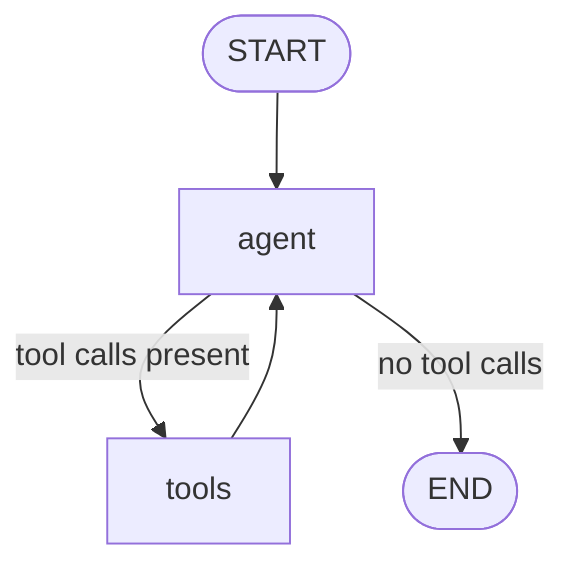

# Module 04 — Tools

*Time: 45 min · Builds on: Module 03*

## What you will be able to do after this module

- Turn a Python function into a tool with `@tool`
- Let the model request tools with `bind_tools`
- Execute those requests with `ToolNode`
- Close the loop with `tools_condition` — your first real agent

> 🎤 Talking points
> This is the module where the Module 00 diagram becomes code. Build it live in four steps and run it after each; do not paste the whole thing at once.

## What a tool is (to the model)

- A **description**: name, what it does, its parameters
- The model reads the descriptions and may reply "please call `X` with these arguments"
- The model never runs anything — *your code* runs the tool and sends the result back
- Then the model reads the result and continues

> 🎤 Talking points
> Repeat the Module 00 point: the model has no hands. A "tool call" is a structured request in the AI message. Show one raw: `AIMessage(tool_calls=[{"name": "add", "args": {"a": 2, "b": 3}}])`.

## Step 1 — define a tool

```python
from langchain_core.tools import tool

@tool
def add(a: int, b: int) -> int:
    """Add two integers and return the sum."""
    return a + b
```

- `@tool` turns a function into a tool object
- The **docstring becomes the description** the model reads — write it for the model
- Type hints become the parameter schema

> 🎤 Talking points
> Delete the docstring and try `bind_tools` — it errors. Good docstrings are prompt engineering: "Add two integers" beats "adds".

## Step 2 — give the model the tools

```python
tools = [add]
llm_with_tools = llm.bind_tools(tools)

reply = llm_with_tools.invoke("What is 2 + 3?")
print(reply.tool_calls)   # [{'name': 'add', 'args': {'a': 2, 'b': 3}, 'id': '...'}]
```

- `bind_tools` attaches the tool descriptions to every call
- The reply is an `AIMessage`; `tool_calls` lists what it wants run
- Nothing has been executed yet

> 🎤 Talking points
> Ask "What is the capital of France?" too — `tool_calls` is empty and `content` has the answer. The model chooses whether to use a tool.

## Step 3 — a node that runs tools

```python
from langgraph.prebuilt import ToolNode
tool_node = ToolNode(tools)
```

- `ToolNode` is a ready-made node
- It reads the last `AIMessage` in `state["messages"]`
- Runs every requested tool, and appends one `ToolMessage` per call

> 🎤 Talking points
> `ToolMessage` is the fourth message type: it carries a tool result back to the model, tagged with the `tool_call_id` so the model knows which request it answers.

## Step 4 — close the loop

```python
from langgraph.prebuilt import tools_condition

def agent(state):
    return {"messages": [llm_with_tools.invoke(state["messages"])]}

builder = StateGraph(State)
builder.add_node("agent", agent)
builder.add_node("tools", tool_node)
builder.add_edge(START, "agent")
builder.add_conditional_edges("agent", tools_condition)   # -> "tools" or END
builder.add_edge("tools", "agent")
```

- `tools_condition` looks at the last message: tool calls → `"tools"`, none → `END`
- `tools → agent` sends results back to the model
- That back-edge is the loop from Module 00

> 🎤 Talking points
> `add_conditional_edges` is new — Module 05 explains it fully. For now: "an edge that picks the next node by looking at state". `tools_condition` is a prebuilt picker.

## The agent graph



- This is a complete tool-using agent
- Add more tools to the list; the graph does not change

> 🎤 Talking points
> Run it with "What is (2+3) multiplied by 4?" after adding a `multiply` tool. Watch the trace: agent → tools → agent → tools → agent → END. Two loops, chosen by the model.

## Reading the trace

```python
for m in result["messages"]:
    print(type(m).__name__, "->", m.content or m.tool_calls)
```

- `HumanMessage` question
- `AIMessage` with `tool_calls`
- `ToolMessage` with the result
- `AIMessage` with the final answer

> 🎤 Talking points
> Have students narrate the trace aloud. Being able to read a message list is the debugging skill for the rest of the course.

## Recap

- `@tool` + a good docstring turns a function into something the model can request.
- `bind_tools` lets the model *request*; `ToolNode` *executes* and appends `ToolMessage`s.
- `tools_condition` on a conditional edge plus a `tools → agent` edge is the whole agent loop.

## Exercise

Add two tools to the graph: `word_count(text: str) -> int` and `reverse(text: str) -> str`. Ask: "How many words are in 'the quick brown fox', and what is it reversed?" Print the trace and count how many times the `tools` node ran.

*Hint:* the model may call both tools in one `AIMessage` — then `tools` runs once and produces two `ToolMessage`s.

## Common mistakes

- Missing docstring on a `@tool` function.
- Using `llm` instead of `llm_with_tools` inside the agent node — the model never asks for tools.
- Forgetting the `tools → agent` edge — the graph ends right after the tool runs, with no final answer.
