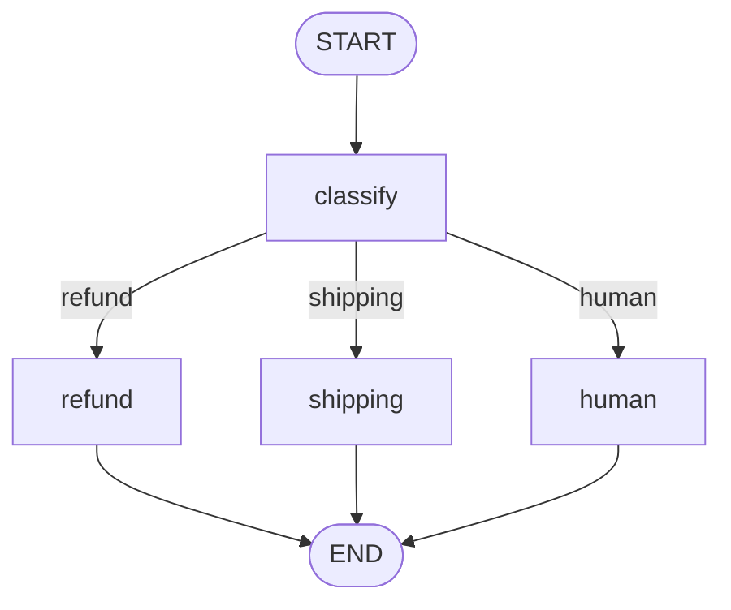

# Module 05 — Conditional Edges & Routing

*Time: 40 min · Builds on: Module 04*

## What you will be able to do after this module

- Write your own router function for `add_conditional_edges`
- Route to more than two destinations
- Use a loop counter in state to guarantee termination
- Split "deciding" from "doing"

> 🎤 Talking points
> Module 04 used a prebuilt router. Today students write their own, which is where LangGraph stops feeling like a black box.

## What a conditional edge is

- A function that receives the state and **returns the name of the next node**
- Declared once with `add_conditional_edges(source, router)`
- It runs after `source` finishes, every time
- It must not modify state — it only reads

> 🎤 Talking points
> Contrast with a node: node = state in, *partial state* out. Router = state in, *node name* out. Same input, different output, different job.

## The simplest router

```python
from typing import Literal

def route(state: State) -> Literal["retry", "done"]:
    if state["answer"] is None:
        return "retry"
    return "done"

builder.add_conditional_edges("check", route)
```

- Return values must be node names (or `END`)
- The `Literal[...]` hint lets LangGraph draw the possible arrows
- Every branch must be a node that exists

> 🎤 Talking points
> Run `draw_mermaid()` with and without the `Literal` hint. Without it, the diagram cannot show where the edge goes. Small habit, big payoff.

## Routing to many destinations

```python
def by_intent(state) -> Literal["refund", "shipping", "human"]:
    return state["intent"]     # set by an earlier node
```

- One router, any number of branches
- Common pattern: a **classify node** writes `intent`, the router reads it
- The model decides *what*; plain code decides *where*

> 🎤 Talking points
> This is the Customer Support pattern from the guide: an LLM node classifies, a deterministic router dispatches. Keeping the router non-LLM makes it testable and fast.

## Deciding vs doing



- `classify` is a node (it may call a model)
- The arrows out of it are one router function
- Each destination node does one job

> 🎤 Talking points
> Ask students to point to where in this picture an `if` statement lives. Answer: only in the router. Nodes stay simple.

## Loops with a safety limit

```python
def should_retry(state) -> Literal["draft", "done"]:
    if state["ok"]:
        return "done"
    if state["attempts"] >= 3:
        return "done"        # give up gracefully
    return "draft"
```

- `attempts` uses the `operator.add` reducer from Module 03
- The node that drafts returns `{"attempts": 1}` each time
- Without the limit, a model that never says "ok" loops forever

> 🎤 Talking points
> Rule to write on the board: **every back-edge needs a counter and a cap**. LangGraph also has a global step limit (default 25, covered in Module 10) as a last resort, but relying on it means your agent ends with an exception instead of a graceful answer.

## Mapping return values to node names

```python
builder.add_conditional_edges(
    "check",
    route,
    {"retry": "draft", "done": END},
)
```

- Optional third argument: a dict from router output → node name
- Lets the router speak in domain words ("retry") while nodes keep their own names
- Also the only way to return `END` under a friendlier label

> 🎤 Talking points
> Useful when the same router is reused across graphs with different node names. Beginners can skip it and return node names directly.

## Recap

- A conditional edge is a function `state -> next node name`, attached with `add_conditional_edges`.
- Use a `Literal` return type so diagrams show all branches; use a classify-then-route split so decisions stay testable.
- Every loop needs a counter in state and a cap in the router.

## Exercise

Build a "draft and check" graph: `draft` asks the model for a one-sentence product tagline and increments `attempts`; `check` sets `ok = True` only if the tagline is under 8 words; a router loops back to `draft` up to 3 times. Print the final tagline and `attempts`.

*Hint:* `check` is plain Python — `len(state["tagline"].split()) < 8` — no model needed.

## Common mistakes

- Router returns a string that is not a node name — LangGraph raises at runtime, not at compile.
- Trying to update state inside a router — the return value is discarded; put updates in a node.
- A back-edge with no counter — the graph hits the recursion limit and crashes.
