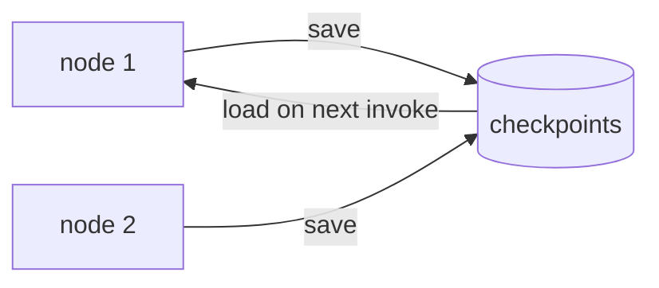

# Module 06 — Memory & Checkpointing

*Time: 40 min · Builds on: Module 05*

## What you will be able to do after this module

- Explain what a checkpointer saves and when
- Attach `MemorySaver` and use `thread_id` to keep conversations apart
- Inspect saved state with `get_state`
- Know when to switch to SQLite

> 🎤 Talking points
> Remember the friction in Module 03 — carrying the message list by hand? Today that disappears. Also plant the seed: the same mechanism enables pausing for humans (Module 07).

## The chore we want to remove

- Every `invoke` starts from the state you pass in
- To continue a chat, the caller had to pass the previous messages back
- Two users talking at once means two lists to juggle
- If the process crashes, everything is gone

> 🎤 Talking points
> Ask: who has written a chatbot that stored history in a global variable? That is the anti-pattern a checkpointer replaces.

## What a checkpointer does

- After **every node**, saves a snapshot of the state
- Snapshots are grouped by a **thread** — one conversation, one thread
- Next `invoke` on the same thread starts from the last snapshot
- Different threads never see each other's state



> 🎤 Talking points
> "After every node" is the key detail. Not just at the end — every step. That is what makes pause/resume possible later.

## Attach `MemorySaver`

```python
from langgraph.checkpoint.memory import MemorySaver

graph = builder.compile(checkpointer=MemorySaver())
```

- One argument at `compile` time; the graph code does not change
- `MemorySaver` keeps snapshots in a Python dict — perfect for lessons and tests
- Lost when the process exits (that is fine for now)

> 🎤 Talking points
> Emphasise "the graph code does not change". Persistence is a property of the compiled graph, not of the nodes.

## Use a `thread_id`

```python
config = {"configurable": {"thread_id": "ada-1"}}

graph.invoke({"messages": [HumanMessage("Hi, I'm Ada")]}, config)
graph.invoke({"messages": [HumanMessage("What's my name?")]}, config)
# -> "Your name is Ada."
```

- `config` is the second argument to `invoke`
- Same `thread_id` → same conversation, history loaded automatically
- The second call passes **only the new message**; the reducer appends it

> 🎤 Talking points
> Run the second call with `thread_id: "bob-1"` and watch the model say it does not know the name. Isolation demonstrated in one line.

## Look inside a thread

```python
snapshot = graph.get_state(config)
print(snapshot.values["messages"])   # full history
print(snapshot.next)                 # which node would run next (empty if finished)
```

- `values` is the saved state
- `next` tells you where the graph stopped — useful in Module 07
- `get_state_history(config)` lists every snapshot, newest first

> 🎤 Talking points
> Show `get_state_history` briefly: students see one snapshot per node. This is "time travel" — you can even re-run from an old snapshot, but that is beyond today.

## Threads are not users

- A thread is one conversation; a user may have many
- Pick `thread_id` deliberately: session id, ticket id, order id
- Never let the model choose it; the calling code owns it
- For "remember across all of a user's conversations" you need a different mechanism (Module 10)

> 🎤 Talking points
> The E-commerce Recommender in the guide uses both: a thread per browsing session, a store per shopper. Keep the distinction crisp now to avoid confusion later.

## When memory should survive a restart

```python
from langgraph.checkpoint.sqlite import SqliteSaver
with SqliteSaver.from_conn_string("checkpoints.db") as saver:
    graph = builder.compile(checkpointer=saver)
```

- Same interface, different storage
- Threads survive process restarts
- Postgres and other savers exist for production; the API is identical

> 🎤 Talking points
> Requires `pip install langgraph-checkpoint-sqlite`. Do not spend long here — the point is that swapping savers is a one-line change.

## Recap

- A checkpointer saves state after every node, grouped by `thread_id`.
- `compile(checkpointer=MemorySaver())` + a `config` with `thread_id` gives you multi-turn memory with no manual history handling.
- `get_state` shows saved values and what runs next; swap to `SqliteSaver` when memory must survive restarts.

## Exercise

Take the tool-using agent from Module 04, compile it with `MemorySaver`, and hold a three-turn conversation on one thread where turn 3 refers back to a number computed in turn 1 ("double the result from before"). Then start a second thread and confirm it has no memory of the first.

*Hint:* print `graph.get_state(config).values["messages"]` between turns to see the history grow.

## Common mistakes

- Forgetting `config` on `invoke` after adding a checkpointer — LangGraph raises "thread_id required".
- Passing the full history again on turn 2 — with `add_messages` this duplicates messages.
- Reusing one `thread_id` for every user — everyone shares one conversation.
