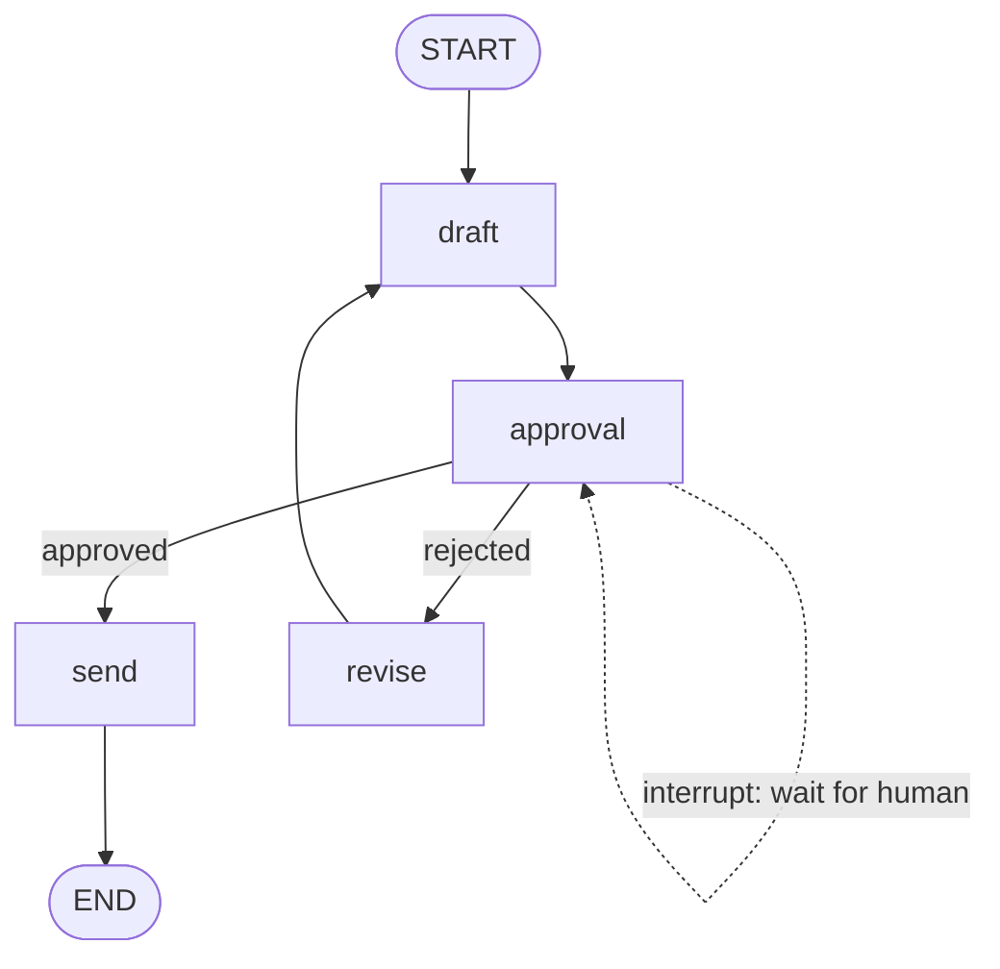

# Module 07 — Human-in-the-Loop

*Time: 40 min · Builds on: Module 06*

## What you will be able to do after this module

- Pause a graph mid-run with `interrupt`
- Resume it with a human's answer using `Command(resume=...)`
- Build an approval gate before a risky action
- Explain why this only works with a checkpointer

> 🎤 Talking points
> This is the payoff of Module 06. "Pause for two days" from Module 01 becomes three lines. Demo it live with a real pause — make the class wait ten seconds before you resume.

## Why agents need a pause button

- Some actions are irreversible: send the email, issue the refund, deploy the rollback
- The model can be confidently wrong
- A human should see the proposal and say yes, no, or "change this"
- Doing that inside a `while` loop meant blocking a process — or losing everything

> 🎤 Talking points
> Tie back to the guide: the Finance Expense Auditor and the DevOps Triage agent both have exactly this gate. It is not an edge case; it is the default for anything that writes.

## `interrupt` — stop here and ask

```python
from langgraph.types import interrupt

def approval(state):
    answer = interrupt({"proposal": state["draft"], "question": "OK to send?"})
    return {"approved": answer == "yes"}
```

- `interrupt(payload)` halts the graph and surfaces the payload to the caller
- The node stops *at that line*
- When resumed, the same node runs again and `interrupt` **returns the human's value**

> 🎤 Talking points
> The "runs again from the top" detail matters: code before `interrupt` in the node executes twice. Keep that code side-effect free (no emails before the gate!).

## What the caller sees

```python
result = graph.invoke({"draft": "Dear customer…"}, config)
print(result["__interrupt__"])   # [Interrupt(value={'proposal': ..., 'question': 'OK to send?'})]
print(graph.get_state(config).next)   # ('approval',)
```

- `invoke` returns early; the state carries an `__interrupt__` entry
- `get_state(...).next` shows the paused node
- The snapshot is in the checkpointer — the process can exit now

> 🎤 Talking points
> Show that a *new* Python process with the same checkpointer file and `thread_id` can resume. That is the two-day pause, for real.

## Resume with `Command`

```python
from langgraph.types import Command

graph.invoke(Command(resume="yes"), config)
```

- Instead of an input dict, pass `Command(resume=value)`
- `value` becomes the return of `interrupt` inside the paused node
- Execution continues from that node as if nothing happened

> 🎤 Talking points
> The resume value can be anything JSON-like: a string, a dict of edits, a whole corrected draft. The node decides what to do with it.

## An approval gate, end to end



- `draft` proposes, `approval` pauses, a router reads `approved`
- `send` is the only node with side effects — and it sits behind the gate
- `revise` can feed the human's feedback back into `draft`

> 🎤 Talking points
> Point at the dotted self-arrow: that is where time passes. Everything to the right of it is "after a human said so".

## Letting the human edit, not just approve

```python
def approval(state):
    edited = interrupt({"draft": state["draft"]})
    return {"draft": edited, "approved": True}
```

- Resume with `Command(resume="Dear valued customer…")`
- The human's version replaces the model's
- Same mechanism, richer payload

> 🎤 Talking points
> This "edit in the loop" pattern is often more useful than yes/no. The Legal reviewer and Marketing agent in the guide could both use it.

## Rules for safe gates

- Compile with a **checkpointer** — without one, `interrupt` raises
- Put the gate **immediately before** the side effect, in its own node
- Keep the gate node free of side effects (it re-runs on resume)
- Validate the resume value — humans make typos too
- Log who resumed and when (audit trail)

> 🎤 Talking points
> The Finance auditor spec has a nice detail: if the manager's decision references a line that was not flagged, it re-interrupts instead of trusting it. Validation belongs in the node, after `interrupt` returns.

## Recap

- `interrupt(payload)` pauses the graph inside a node and surfaces `payload`; the snapshot lives in the checkpointer.
- `graph.invoke(Command(resume=value), config)` continues; `value` is what `interrupt` returns.
- Put the gate right before the side effect, keep it side-effect free, and validate what the human sends back.

## Exercise

Build the approval graph above with a `draft` node that asks the model for a two-sentence apology email and a `send` node that just prints "SENT: …". Run it, observe the interrupt, resume once with `"no"` (should loop to revise/draft) and once with `"yes"` (should print SENT).

*Hint:* `revise` can append a `HumanMessage("Make it shorter")` to `messages` so the next draft changes.

## Common mistakes

- Compiling without a checkpointer — `interrupt` has nowhere to save the pause.
- Putting the side effect *before* `interrupt` in the same node — it runs twice.
- Passing a normal dict instead of `Command(resume=...)` to continue — the graph starts a fresh run instead of resuming.
