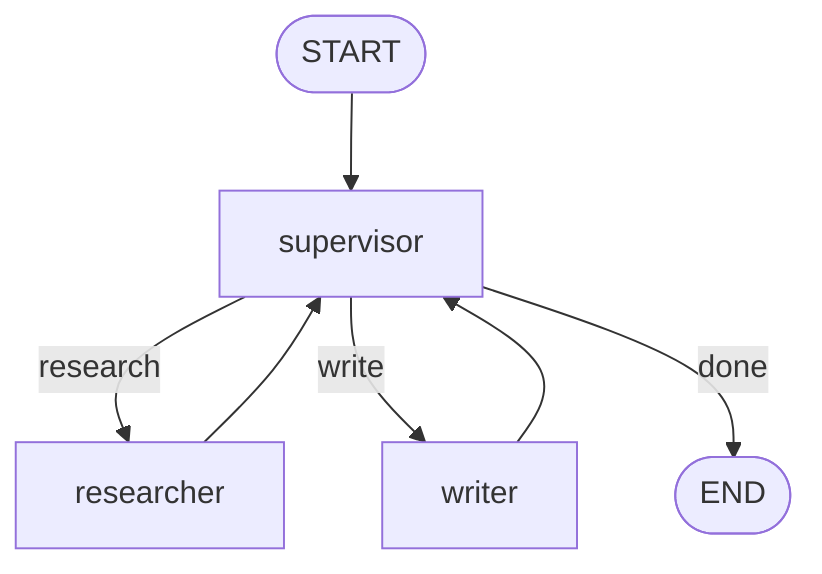
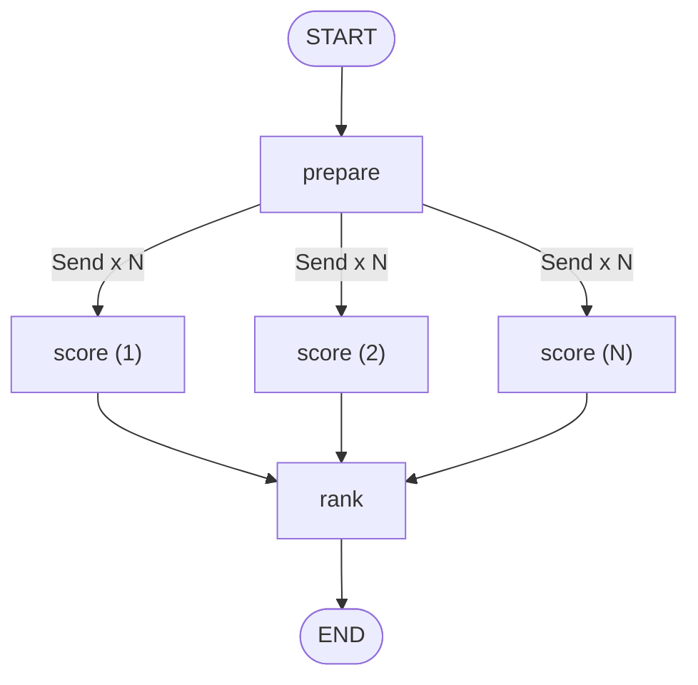

# Module 08 — Multi-Agent Patterns

*Time: 45 min · Builds on: Module 07*

## What you will be able to do after this module

- Build a supervisor that delegates to specialist nodes
- Fan out work in parallel with `Send` and collect results with a reducer
- Wrap a graph as a node inside another graph (subgraphs)
- Choose between the three patterns

> 🎤 Talking points
> "Multi-agent" sounds grand; in LangGraph it is just three graph shapes. Students already know every ingredient — routers, reducers, nodes. Today is composition.

## When one agent is not enough

- One prompt trying to do five jobs does all five badly
- Specialists (a researcher, a writer, a checker) each get a focused prompt and tool set
- Some work is naturally parallel: score 50 resumes, review 20 clauses
- Teams want to own and test pieces independently

> 🎤 Talking points
> The guide's HR screener and Legal reviewer are the parallel examples; Customer Support is the specialist-dispatch example. Reference them, but build small versions here.

## Pattern 1 — Supervisor



- A `supervisor` node asks the model: "who should act next?"
- A router dispatches to the chosen specialist
- Every specialist reports back to the supervisor
- Ends when the supervisor says done (with a step cap!)

> 🎤 Talking points
> This is Module 05's classify-then-route, in a loop. The supervisor's prompt lists the specialists and their skills; its output is just a name. Cap the loop — supervisors love to keep delegating.

## Supervisor in code (sketch)

```python
def supervisor(state) -> dict:
    choice = llm.with_structured_output(Route).invoke(state["messages"])
    return {"next": choice.next, "steps": 1}

def dispatch(state) -> Literal["researcher", "writer", "__end__"]:
    if state["steps"] > 6: return "__end__"
    return state["next"]
```

- `with_structured_output` forces the model to return a valid choice
- `steps` uses `operator.add`; the router caps it
- Specialists are ordinary chat nodes with their own tools

> 🎤 Talking points
> `with_structured_output(SomePydanticModel)` is a LangChain helper worth showing: it makes "return one of these names" reliable. Module 10 reuses it for validation.

## Pattern 2 — Parallel fan-out with `Send`

```python
from langgraph.types import Send

def fan_out(state):
    return [Send("score", {"resume": r}) for r in state["resumes"]]

builder.add_conditional_edges("prepare", fan_out)
```

- A router can return a **list of `Send`** objects instead of one name
- Each `Send(node, payload)` starts that node with its own private input
- All branches run concurrently; the graph waits for every one before continuing

> 🎤 Talking points
> The payload is *not* the shared state — it is whatever you pass. The `score` node receives `{"resume": ...}`. This is how 50 resumes get 50 independent model calls.

## Collecting the results

```python
class State(TypedDict):
    resumes: list[str]
    scores: Annotated[list[dict], operator.add]

def score(payload) -> dict:
    return {"scores": [{"resume": payload["resume"], "score": 7}]}
```

- Each branch returns a one-element list
- The `operator.add` reducer from Module 03 concatenates them
- The next node sees all scores at once

> 🎤 Talking points
> Without the reducer, the branches would overwrite each other and you would get one score. This is the single most common fan-out bug.

## Fan-out diagram



- `rank` runs once, after all branches finish
- Branch failures should be handled inside `score` so one bad input does not stop the batch

> 🎤 Talking points
> Ask: what if N is 10,000? Answer: batch the `Send`s, or add a concurrency limit at the model client level. Fan-out is easy to write and easy to overload.

## Pattern 3 — Subgraphs

```python
support_graph = support_builder.compile()
main_builder.add_node("support", support_graph)   # a compiled graph is a node
```

- Any compiled graph can be added as a node
- If it shares state keys with the parent, they flow in and out automatically
- Otherwise wrap it in a small function that translates between the two states

> 🎤 Talking points
> This is how teams scale: the support team owns `support_graph`, tests it alone, and the platform team plugs it in. The Module 04 agent can become a node in a bigger graph without changes.

## Choosing a pattern

| Need | Pattern |
|---|---|
| Different skills, one at a time, model decides order | Supervisor |
| Same job over many inputs | `Send` fan-out |
| Reuse or isolate a whole workflow | Subgraph |
| Combination (e.g. supervisor whose specialist fans out) | Nest them |

> 🎤 Talking points
> Nesting is normal. The Legal reviewer in the guide is a fan-out inside a linear pipeline; DevOps triage is three parallel gatherers feeding a supervisor-like diagnoser.

## Recap

- Supervisor = a routing loop where the model picks the next specialist; cap the steps.
- `Send` fans work out in parallel with private payloads; an `operator.add` reducer gathers the results.
- A compiled graph is a node — subgraphs let teams own and test pieces independently.

## Exercise

Build a fan-out graph that takes a list of five product names, sends each to a `describe` node that asks the model for a one-line description, and then a `combine` node that joins them into a bulleted list. Confirm all five descriptions appear.

*Hint:* the state needs `products: list[str]` and `descriptions: Annotated[list[str], operator.add]`; `describe` returns `{"descriptions": [text]}`.

## Common mistakes

- Fan-out results overwriting each other — missing `operator.add` on the collecting key.
- A supervisor with no step cap — it delegates forever.
- Expecting a `Send` payload to include the full shared state — it only includes what you pass.
