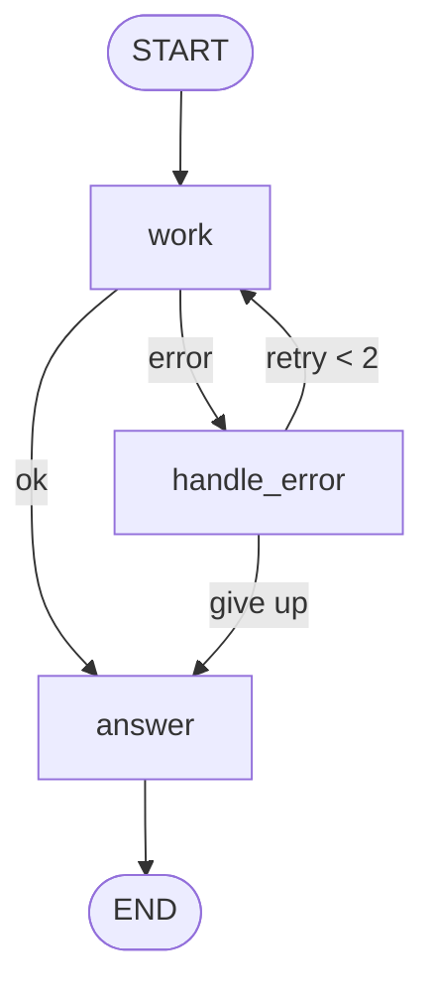

# Module 10 — Guardrails & Deployment

*Time: 45 min · Builds on: Module 09*

## What you will be able to do after this module

- Add the four standard guardrails: loop limits, input validation, error nodes, output checks
- Use `Store` for memory that spans threads
- Describe the deployment options and pick one for a first project
- Ship a graph that fails safely

> 🎤 Talking points
> Everything so far was "make it work". This module is "make it safe and keep it running". Every guide agent has a Guardrails section — this is where those come from.

## Guardrail 1 — loop limits, two layers

```python
graph.invoke(inputs, {**config, "recursion_limit": 30})
```

- Layer 1: your own counters + router caps (Module 05) — graceful exit
- Layer 2: `recursion_limit` in config — hard stop with an exception
- Set both; the hard stop is the safety net, not the plan
- Default is 25 steps; a step is one node execution

> 🎤 Talking points
> A graceful exit returns a useful answer ("I could not resolve this after 3 tries"). A hard stop returns a stack trace. Users deserve the former; ops needs the latter.

## Guardrail 2 — validate inputs at the door

```python
from pydantic import BaseModel, Field

class Question(BaseModel):
    text: str = Field(min_length=3, max_length=2000)
    db: str = Field(pattern=r"^sqlite:///")

def validate(state):
    Question(text=state["question"], db=state["db_uri"])   # raises on bad input
    return {}
```

- First node in the graph; plain Pydantic
- Rejects oversized, malformed, or out-of-policy input before any model call
- Also the place to mask secrets and PII (card numbers, tokens)

> 🎤 Talking points
> Cheap and boring, and it removes a whole class of prompt-injection and cost problems. The Healthcare intake agent runs a scrub node first for exactly this reason.

## Guardrail 3 — error nodes instead of exceptions



- Tools and models fail; catch inside the node and write `error` to state
- A router sends errors to a `handle_error` node that decides: retry, fallback, or explain
- The graph always reaches `END` with something sayable

> 🎤 Talking points
> Rule from the guide specs: **fail closed** when in doubt. If the safety classifier is down, escalate; if the stock check is down, recommend nothing. Write the failure behaviour per tool before writing the tool.

## Guardrail 4 — check outputs before they leave

```python
def output_check(state):
    verdict = llm.with_structured_output(Verdict).invoke(
        f"Does this reply contain medical advice? {state['reply']}")
    return {"safe": verdict.safe}
```

- A small model call (or regex) that inspects the final text
- Route unsafe outputs to a rephrase node with a loop cap
- Use it for: policy words, PII, claims not in the source, tone

> 🎤 Talking points
> `with_structured_output` from Module 08 returns a typed yes/no. Keep the checker prompt narrow — one question, one boolean — so it stays reliable and cheap.

## Memory across threads — `Store`

```python
from langgraph.store.memory import InMemoryStore
store = InMemoryStore()
graph = builder.compile(checkpointer=MemorySaver(), store=store)

def remember(state, *, store):
    store.put(("user", state["user_id"]), "profile", {"size": "US 9"})
    return {}
```

- Checkpointer = one thread's history; `Store` = facts that outlive threads
- Namespaced by a tuple you choose (e.g. `("user", id)`)
- Nodes receive `store` as a keyword argument
- Persistent backends exist just like for checkpointers

> 🎤 Talking points
> The E-commerce recommender in the guide is the reference: session in the thread, preferences in the store. Never let the model pick the namespace — the calling code does, from an authenticated id.

## Deployment options

| Option | What it is | Pick it when |
|---|---|---|
| Your own server | Wrap `graph.invoke` / `stream` in FastAPI; you run checkpointer + store DBs | You already have infra and want full control |
| LangGraph Platform | Hosted runtime: API, persistence, streaming, and a studio UI for graphs | You want to ship in a day and see runs visually |
| Serverless | Graph per request; persistence must be external (Postgres saver) | Spiky, low-volume workloads |

- In all cases: put secrets in env vars, persist checkpoints outside the process, and trace every run

> 🎤 Talking points
> For a first project: LangGraph Platform or a tiny FastAPI app with `SqliteSaver`. Do not build a queue system on day one.

## A pre-ship checklist

- [ ] Every back-edge has a counter and cap; `recursion_limit` set
- [ ] First node validates and scrubs input
- [ ] Every tool has a written failure behaviour and it is implemented
- [ ] Side effects sit behind an `interrupt` gate or are idempotent
- [ ] Output check on anything user-facing in a sensitive domain
- [ ] Persistent checkpointer; `thread_id` chosen by your code
- [ ] Tracing on, with tags for prompt version

> 🎤 Talking points
> Have students grade the Module 04 agent against this list. It fails most items — which is fine; that is what the capstone is for.

## Recap

- Four guardrails: loop limits (two layers), input validation, error nodes with fail-closed defaults, output checks.
- `Store` holds cross-thread memory, namespaced by ids your code controls.
- Deploy behind your own API or on LangGraph Platform; either way, persist checkpoints externally and trace everything.

## Exercise

Take the Module 05 "draft and check" graph and add: a `validate` first node that rejects empty product names, a `handle_error` node that catches a model exception (simulate one by raising in `draft` on the first attempt) and retries once, and a `recursion_limit` of 15. Confirm the graph still ends gracefully in every case.

*Hint:* wrap the model call in `try/except` inside `draft` and return `{"error": str(e)}` instead of raising; route on `error`.

## Common mistakes

- Relying only on `recursion_limit` — users get exceptions instead of answers.
- Letting a tool exception propagate out of a node — the whole run dies with no state saved for that step.
- Using the checkpointer for user preferences — they vanish when the thread does; that is what `Store` is for.
