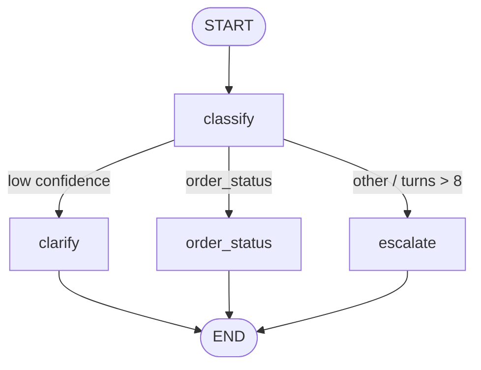
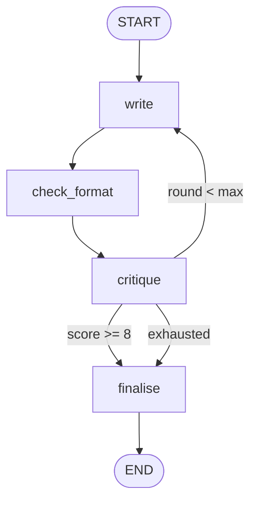

# Module 11 — Capstone Case Studies

*Time: 90 min (4 × ~20 min) · Builds on: Modules 00–10*

This module walks through four agents from the prompt library, one per major pattern. Each case study reads the spec, maps it to the concepts you learned, and asks you to build the skeleton.

Specs live in the guide:

- [04 Customer Support](../../guide/agents/04_customer_support.md) — routing
- [06 Finance Expense Auditor](../../guide/agents/06_finance_expense_auditor.md) — human-in-the-loop
- [07 Marketing Content](../../guide/agents/07_marketing_content.md) — critique loop
- [11 E-commerce Recommender](../../guide/agents/11_ecommerce_recommender.md) — memory across sessions

## How to read a spec

- **State Schema** table → your `TypedDict`; the reducer column tells you where `Annotated` goes
- **Graph Design** → `add_node` for every row, `add_edge` / `add_conditional_edges` for every bullet
- **Tools** → one `@tool` per row; the failure column is a `try/except` inside the node
- **Per-Node System Prompts** → the string you pass to the model in that node
- **Guardrails** → validation node, counters, output check, interrupt gates
- **Evaluation** → your test cases

> 🎤 Talking points
> The whole point of the spec format is that it maps one-to-one onto the API you now know. Read a section, write the code for it, move on. Nobody has to design anything from scratch here.

## Case 1 — Customer Support: routing (Modules 03, 05, 06)

- State: `messages` with `add_messages`, `intent`, `intent_confidence`, `turns` with `operator.add`
- Nodes: `classify` (model, structured output) + five specialist nodes + `escalate`
- Router: reads `intent` and confidence; low confidence → `clarify`; `turns > 8` → `escalate`
- `clarify → END` then wait — the checkpointer keeps the thread so the next message re-enters at `classify`

> 🎤 Talking points
> This is Module 05's classify-then-route plus Module 06's threads. Point out `clarify → END`: a graph can end *mid-conversation* and continue on the next `invoke`. That is normal, not a hack.

## Case 1 — build it

- Build with just `order_status` and `escalate` first; add the others once routing works
- Stub `get_order` to return a fixed dict
- Test: the E2 case ("It's broken") must produce a single question

> 🎤 Talking points
> Encourage stubbing every tool with a lambda before writing real ones. The graph logic is testable with fakes; real integrations come last.

## Case 2 — Finance Expense Auditor: approval gate (Modules 05, 06, 07)

- Most nodes are **plain Python**: `run_rules`, `decide`, `apply_review` — no model
- Only `prepare_review` calls the model
- `human_review` is one line: `decision = interrupt(state["review_packet"])`
- `decide → finalise` when nothing is flagged; otherwise through the gate

> 🎤 Talking points
> This case corrects a misconception: an "AI agent" can be 80 % deterministic code. The model writes the manager's summary; the rules make the decisions. That is what makes it auditable.

## Case 2 — build it

- Rules as a list of small functions `(line, policy) -> RuleResult`
- `decide` puts any line over $500 or with an unknown result into `needs_review`
- Compile with `MemorySaver`; run; observe `__interrupt__`; resume with `Command(resume={"decisions": {...}})`
- Validate the resume value: unknown line id → re-interrupt

> 🎤 Talking points
> Have students kill the Python process after the interrupt and resume from a fresh one using `SqliteSaver`. Seeing it work end to end is the "aha" of Module 07.

## Case 3 — Marketing Content: critique loop (Modules 03, 05, 08)

- Two model nodes with two personas: `write` and `critique`
- `history` with `operator.add` keeps every round; `round` with `operator.add` counts
- Router after `critique`: score ≥ 8 → `finalise`; `round < max_rounds` → `write`; else `finalise`
- `finalise` picks the best round from `history`, not the last

> 🎤 Talking points
> The best-of-history detail is worth dwelling on: quality can go *down* in a revision. Because state kept every round, choosing the best is a `max()` over a list.

## Case 3 — build it

- `check_format` is plain Python: banned words + length limit
- Use `with_structured_output` for the critique so `score` is always an int
- Test: a brand guide banning the word "revolutionary" must never appear in the final copy

> 🎤 Talking points
> Optional stretch from the spec: fan out `write` into three variants with `Send` and let `critique` pick — Module 08 inside Module 07's loop.

## Case 4 — E-commerce Recommender: two memories (Modules 06, 10)

- Thread state (checkpointer): this session's `messages`, `query`, `candidates`
- Long-term (`Store`, namespace `("shopper", id)`): `profile`, `feedback`
- `load_memory` reads the store at the start; `update_memory` writes durable facts at the end
- `memory_view` and `memory_forget` intents give the shopper control

> 🎤 Talking points
> Session 1 and Session 2 in the spec use different `thread_id`s but the same `shopper_id`. Have students run both and watch the second session apply the size and excluded brand without being told.

## Case 4 — build it

- Hard constraints are enforced **in code** after `build_query` — filter candidates by size/brand/budget regardless of the model's output
- `check_stock` failure → empty recommendations and an honest reply (fail closed)
- `update_memory` returns `memory_updates` so the user sees what was stored
- Test E3: a card number in the message must never reach the store

> 🎤 Talking points
> Close with the Module 10 checklist applied to this agent. It should pass every item — the spec was written that way. That is the standard for their own agents.

## Recap

- A spec's sections map directly onto LangGraph API: state table → `TypedDict`, graph design → nodes and edges, tools → `@tool`, guardrails → validation/caps/gates/checks.
- The four cases cover routing, approval gates, critique loops, and cross-session memory — every pattern from Modules 03–10.
- Stub tools first, test the graph logic with fakes, then wire real integrations.

## Exercise

Pick one of the other seven agents in the guide (SQL analyst, CSV analyst, BI insights, HR screener, Legal reviewer, Healthcare intake, DevOps triage). Read its spec and write: the `TypedDict`, the builder code with all nodes and edges (nodes can be stubs that return fixed dicts), and the router functions. Print the mermaid diagram and compare it with the one in the spec.

*Hint:* start from the Graph Design table; every row is an `add_node`, every bullet is an edge. The diagram should match before you write any real node logic.

## Common mistakes

- Writing real tool integrations before the graph shape is right — debug logic with stubs first.
- Putting decisions in model nodes that the spec assigns to code (severity matrix, hard constraints, rule checks).
- Skipping the spec's Evaluation table — those cases are the acceptance tests; implement them as tests.
