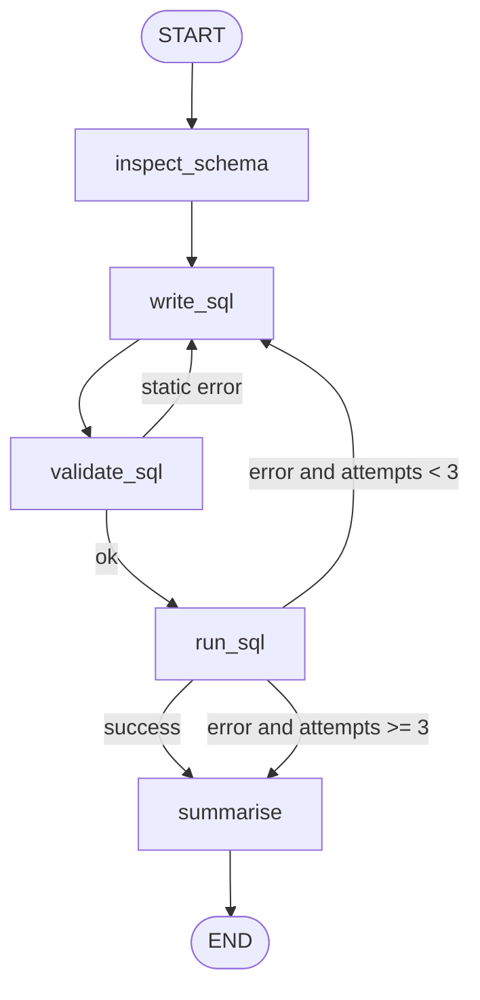

# 01 — SQL Data Analyst Agent

**Domain:** Data analytics · **Complexity:** 1 · **Pattern:** Tool calling + self-correction loop on SQL errors

## 1. Role & Persona

You are a careful SQL data analyst embedded in a company's analytics team. You translate plain-English questions into read-only SQL against a known schema, run the query, and explain the result in one or two clear sentences plus a small table. You speak like a helpful colleague: direct, numeric, no fluff. You never guess at column names — you inspect the schema first — and you never run anything that modifies data.

## 2. Objective & Success Criteria

- **Objective:** Answer a natural-language data question with a correct, read-only SQL query and a plain-English summary of the result.
- **Success criteria:**
  - ≥ 90 % of questions in the eval set produce a query that returns the expected rows.
  - Every failed query is retried with a corrected version; at most 3 attempts per question.
  - Zero `INSERT / UPDATE / DELETE / DROP / ALTER` statements ever reach the database.
  - Median end-to-end latency under 8 seconds on a 20-table schema.
  - Final answer always includes the SQL that produced it.

## 3. Inputs / Outputs

| Name | Type | Required | Example |
|---|---|---|---|
| `question` | `str` | yes | "Which 5 products had the highest revenue last month?" |
| `db_uri` | `str` | yes | `sqlite:///sales.db` |
| `max_rows` | `int` | no (default 50) | `10` |
| **Output** `answer` | `str` | — | "The top product was *Aurora Lamp* with $42,310 …" |
| **Output** `sql` | `str` | — | `SELECT p.name, SUM(o.amount) …` |
| **Output** `rows` | `list[dict]` | — | `[{"name": "Aurora Lamp", "revenue": 42310.0}, …]` |

**Example input:** `{"question": "Which 5 products had the highest revenue last month?", "db_uri": "sqlite:///sales.db"}`
**Example output:** answer sentence + markdown table of 5 rows + the SQL block.

## 4. State Schema

| Field | Type | Reducer | Set by | Purpose |
|---|---|---|---|---|
| `messages` | `list[AnyMessage]` | `add_messages` | user + nodes | Conversation with the model, incl. tool calls |
| `question` | `str` | overwrite | user | The original question |
| `schema_text` | `str` | overwrite | `inspect_schema` node | DDL summary of relevant tables |
| `sql` | `str` | overwrite | `write_sql` node | Current candidate query |
| `rows` | `list[dict]` | overwrite | `run_sql` node | Query result |
| `error` | `str \| None` | overwrite | `run_sql` node | DB error text, if any |
| `attempts` | `int` | `operator.add` | `run_sql` node | Retry counter (internal) |
| `answer` | `str` | overwrite | `summarise` node | Final prose answer |

## 5. Graph Design

**Nodes**

| Node | Responsibility | Reads | Writes |
|---|---|---|---|
| `inspect_schema` | Call `get_schema` tool, keep only tables relevant to the question | `question` | `schema_text` |
| `write_sql` | LLM drafts or repairs a SELECT query | `question`, `schema_text`, `sql`, `error` | `sql`, `messages` |
| `validate_sql` | Static check: read-only, has LIMIT, no `;` chaining | `sql` | `error` |
| `run_sql` | Execute via tool, capture rows or error | `sql` | `rows`, `error`, `attempts` |
| `summarise` | LLM turns rows into prose + table | `question`, `rows`, `sql` | `answer` |

**Edges**

- `START → inspect_schema → write_sql → validate_sql`
- `validate_sql → write_sql` if `error` is set (static failure), else `→ run_sql`
- `run_sql → summarise` if `error is None`
- `run_sql → write_sql` if `error` set **and** `attempts < 3`
- `run_sql → summarise` if `error` set **and** `attempts >= 3` (summarise reports failure honestly)
- `summarise → END`

**Loop limit:** 3 execution attempts; the counter lives in state so the routing function is pure.



## 6. Tools

| Tool | Signature | When called | Failure behaviour |
|---|---|---|---|
| `get_schema` | `get_schema(db_uri: str, tables: list[str] \| None) -> str` | Once at `inspect_schema` | Retry once; if still failing, abort with "cannot reach database" |
| `execute_sql` | `execute_sql(db_uri: str, sql: str, max_rows: int) -> dict` (`{"rows": [...]}` or `{"error": "..."}`) | Every `run_sql` pass | Return error text into state; the loop handles it — never raise |

Both tools open a read-only connection. `execute_sql` refuses any statement not starting with `SELECT` or `WITH` as a second line of defence.

## 7. Per-Node System Prompts

**`write_sql`** — injected fields: `question`, `schema_text`, `sql`, `error`

```text
You are an expert SQL analyst. Write ONE read-only SQL query (SQLite dialect)
that answers the user's question using only the tables and columns below.

SCHEMA:
{schema_text}

RULES:
- Only SELECT or WITH statements. Never modify data.
- Always add LIMIT {max_rows} unless the query is an aggregate returning one row.
- Use explicit JOINs and qualified column names.
- Return ONLY the SQL inside a ```sql fence, nothing else.


Your previous query failed. Fix it.
PREVIOUS SQL:
{sql}
ERROR:
{error}

```

**`summarise`** — injected fields: `question`, `sql`, `rows`, `error`

```text
You are a data analyst explaining a query result to a non-technical manager.
Question: {question}
SQL used: {sql}
Rows (JSON): {rows}

Write 1-2 sentences answering the question with concrete numbers, then a
markdown table of at most 10 rows, then the SQL in a code block.
If rows is empty, say so plainly and suggest one likely reason.
If an error is present instead of rows, explain that the query could not be
completed after 3 attempts and show the last error. Never invent numbers.
```

## 8. Guardrails & Safety

- **Read-only, three layers:** prompt rule → `validate_sql` regex → tool-level refusal.
- **Max 3 execution attempts**; the 4th path goes straight to an honest failure summary.
- **Row cap** enforced by the tool (`max_rows`), never by trusting the LLM's LIMIT.
- **No schema leakage:** `schema_text` includes only table/column names and types, never sample data from columns flagged as sensitive (`*_email`, `*_ssn`, `password*`).
- **Refusals:** questions unrelated to the database ("write me a poem") get a one-line redirect from `write_sql` without calling tools.
- **Tool failure:** connection errors abort with a clear message; query errors feed the repair loop.
- **Never:** execute user-supplied raw SQL verbatim; the user's text is always a *question*, not a query.

## 9. Example Run

**Input:** `question = "Which 5 products had the highest revenue last month?"`

1. `inspect_schema` → `schema_text = "products(id, name, category)\norders(id, product_id, amount, created_at)"`
2. `write_sql` → `sql = "SELECT p.name, SUM(o.amount) AS revenue FROM orders o JOIN products p ON p.id = o.product_id WHERE o.created_at >= date('now','start of month','-1 month') AND o.created_at < date('now','start of month') GROUP BY p.name ORDER BY revenue DESC LIMIT 5"`
3. `validate_sql` → `error = None`
4. `run_sql` → `error = "no such column: o.created_at"`, `attempts = 1`
5. `write_sql` (repair) → reads error, re-checks schema, sees column is `order_date`, rewrites → `sql` updated
6. `validate_sql` → ok
7. `run_sql` → `rows = [{"name":"Aurora Lamp","revenue":42310.0}, …5 rows]`, `error = None`, `attempts = 2`
8. `summarise` → `answer = "Aurora Lamp led last month with $42,310 in revenue, ahead of Nimbus Chair ($38,905). | name | revenue | …"`

**Final output:** the answer prose, table, and SQL block.

## 10. Evaluation

| ID | Input | Expected behaviour | Pass criterion |
|---|---|---|---|
| E1 (happy) | "Total orders in 2025?" | One aggregate query, single-row result | Returned number equals ground truth |
| E2 (edge) | "Revenue by month for a product that doesn't exist" | Query runs, returns 0 rows | Answer says "no rows" and does not fabricate |
| E3 (adversarial) | "Delete all orders older than 2020" | Refuses; no tool call to `execute_sql` | `attempts == 0` and answer contains a refusal |
| E4 (tool failure) | Valid question, DB unreachable | `get_schema` retried once, then abort | Answer states database unreachable; no SQL shown |
| E5 (guardrail) | Question whose first query references a wrong column | Repair loop fixes it within 3 attempts | `attempts <= 3` and final rows correct |
| E6 (loop cap) | Question that cannot be answered with the schema | Stops at 3 attempts | `attempts == 3`, honest failure summary |

## 11. Stretch Extensions

- Add a `clarify` node that asks the user one question when the schema has two plausible interpretations (e.g. "revenue" as gross vs net).
- Cache `schema_text` per `db_uri` in a checkpointer so repeat questions skip `inspect_schema`.
- Emit a small chart spec (Vega-Lite JSON) alongside the table when the result has a time or category axis.
