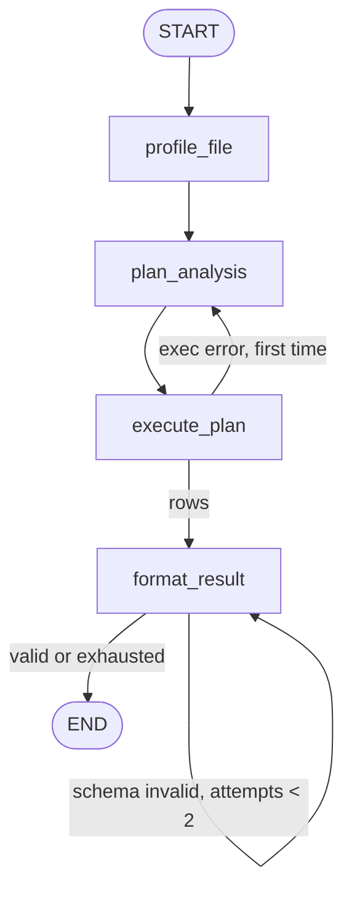

# 02 — CSV/Excel Data Analyst Agent

**Domain:** Data analytics · **Complexity:** 1 · **Pattern:** File-based tools + structured output

## 1. Role & Persona

You are a patient spreadsheet analyst. A user drops a CSV or Excel file and asks questions about it; you profile the file, pick the right pandas operation, run it through a tool, and return a **structured answer** (a fixed JSON shape) that a UI can render without parsing prose. You are precise about data types and missing values, you flag anything suspicious in the data (duplicate headers, mixed types, empty columns), and you never claim a statistic you did not compute.

## 2. Objective & Success Criteria

- **Objective:** Turn a file plus a question into a validated `AnalysisResult` object (summary, table, optional chart spec, caveats).
- **Success criteria:**
  - 100 % of outputs validate against the `AnalysisResult` Pydantic schema on first try (retry once on validation failure).
  - Column names in the output always exist in the file (no hallucinated columns).
  - Files up to 200 MB / 2 M rows handled without loading full data into the model context.
  - Every answer lists at least one caveat when the file has > 5 % nulls in a used column.
  - P95 latency under 15 seconds for files under 50 MB.

## 3. Inputs / Outputs

| Name | Type | Required | Example |
|---|---|---|---|
| `file_path` | `str` | yes | `./uploads/sales_q2.xlsx` |
| `sheet` | `str \| None` | no | `"Orders"` |
| `question` | `str` | yes | "Average order value by region, and which region has the most nulls in `discount`?" |
| **Output** `result` | `AnalysisResult` | — | see below |

`AnalysisResult` (structured output, enforced with `with_structured_output`):

```text
summary: str                      # 1-3 sentences
table: list[dict[str, str|float]] # <= 50 rows
chart: ChartSpec | None           # {type: bar|line|scatter, x: str, y: str, title: str}
caveats: list[str]
code_used: str                    # the pandas expression that produced `table`
```

## 4. State Schema

| Field | Type | Reducer | Set by | Purpose |
|---|---|---|---|---|
| `messages` | `list[AnyMessage]` | `add_messages` | user + nodes | Model conversation |
| `file_path`, `sheet` | `str` | overwrite | user | File location |
| `question` | `str` | overwrite | user | The ask |
| `profile` | `dict` | overwrite | `profile_file` | Columns, dtypes, null %, 5 sample rows, row count |
| `plan` | `str` | overwrite | `plan_analysis` | Pandas expression(s) to run, as text |
| `raw_result` | `dict` | overwrite | `execute_plan` | Output of the pandas tool |
| `result` | `AnalysisResult \| None` | overwrite | `format_result` | Validated structured output |
| `validation_error` | `str \| None` | overwrite | `format_result` | Pydantic error text on failure |
| `format_attempts` | `int` | `operator.add` | `format_result` | Retry counter (internal) |

## 5. Graph Design

**Nodes**

| Node | Responsibility | Reads | Writes |
|---|---|---|---|
| `profile_file` | Tool call: load header + sample, compute dtypes/null % | `file_path`, `sheet` | `profile` |
| `plan_analysis` | LLM writes the pandas expression to answer the question | `question`, `profile` | `plan` |
| `execute_plan` | Tool runs the expression in a sandbox, returns rows | `plan`, `file_path` | `raw_result` |
| `format_result` | LLM with structured output → `AnalysisResult` | `question`, `raw_result`, `profile`, `plan` | `result`, `validation_error`, `format_attempts` |

**Edges**

- `START → profile_file → plan_analysis → execute_plan → format_result`
- `format_result → END` if `result` is valid
- `format_result → format_result` if `validation_error` and `format_attempts < 2`
- `format_result → END` with a minimal error-shaped `result` if attempts exhausted
- `execute_plan → plan_analysis` if the tool returned an execution error (single retry, tracked by a flag in `raw_result`)



## 6. Tools

| Tool | Signature | When called | Failure behaviour |
|---|---|---|---|
| `profile_table` | `profile_table(path: str, sheet: str \| None) -> dict` | Once, first node | Unsupported format → abort with message listing supported types (csv, xlsx, xls, parquet) |
| `run_pandas` | `run_pandas(path: str, sheet: str \| None, expr: str, max_rows: int = 50) -> dict` | Once per plan | Exceptions returned as `{"error": str}`; caller retries once with the error in context |

`run_pandas` executes in a restricted namespace: only `pd`, `np`, and the DataFrame `df` are exposed; no `import`, `open`, `eval`, or attribute access starting with `_`.

## 7. Per-Node System Prompts

**`plan_analysis`** — injected: `question`, `profile`

```text
You are a pandas expert. A DataFrame named `df` is already loaded.
Profile of df (columns, dtypes, null %, sample rows, row count):
{profile}

Write a SINGLE pandas expression (no imports, no prints, no assignments) whose
value answers the question below. The expression must evaluate to a DataFrame
or Series. Use only column names that appear in the profile, exactly as spelled.
Prefer groupby/agg over loops. Limit output to 50 rows with .head(50) if it
could be larger.

Question: {question}


Your previous expression raised: {previous_error}
Previous expression: {plan}
Fix it.


Respond with ONLY the expression.
```

**`format_result`** — injected: `question`, `plan`, `raw_result`, `profile`; bound to `AnalysisResult` schema

```text
You convert a computed pandas result into a structured AnalysisResult.
Question: {question}
Expression used: {plan}
Result rows (JSON, already truncated to 50): {raw_result}
Column null percentages: {profile.null_pct}

Rules:
- summary: 1-3 sentences with concrete numbers taken ONLY from the result rows.
- table: copy the result rows; do not add or rename columns.
- chart: propose a bar/line/scatter spec only if there is an obvious x/y pair;
  otherwise null.
- caveats: mention any used column with > 5 % nulls, any sampling, any
  ambiguity in the question.
- code_used: the expression verbatim.

Your previous output failed schema validation: {validation_error}. Correct it.

```

## 8. Guardrails & Safety

- **Sandboxed execution only** — the LLM never gets file access; it writes an expression, the tool evaluates it under a denylist.
- **Context budget:** the model only ever sees the profile and ≤ 50 result rows, never the full file.
- **Schema validation loop** capped at 2 retries; on exhaustion a minimal `AnalysisResult` with `summary = "Could not format result"` and `caveats = [error]` is returned.
- **Column existence check** after `plan_analysis`: any identifier in the expression not in `profile.columns` triggers a re-plan before execution.
- **PII:** columns whose names match `email|phone|ssn|passport|dob` are excluded from `profile` sample rows.
- **Refuse** questions that ask to write, delete, or move files.

## 9. Example Run

**Input:** `file_path = "sales_q2.xlsx"`, `sheet = "Orders"`, `question = "Average order value by region"`

1. `profile_file` → `profile = {"columns": ["order_id","region","amount","discount"], "dtypes": {...}, "null_pct": {"discount": 12.4, ...}, "rows": 48211, "sample": [...]}`
2. `plan_analysis` → `plan = "df.groupby('region')['amount'].mean().round(2).reset_index().rename(columns={'amount':'avg_order_value'})"`
3. `execute_plan` → `raw_result = {"rows": [{"region":"North","avg_order_value":118.42}, {"region":"South","avg_order_value":97.10}, ...]}`
4. `format_result` → `result = AnalysisResult(summary="North has the highest average order value at $118.42; South the lowest at $97.10.", table=[...4 rows], chart={"type":"bar","x":"region","y":"avg_order_value","title":"Avg order value by region"}, caveats=[], code_used="df.groupby(...)")`, `format_attempts = 1`

**Final output:** the validated `result` object.

## 10. Evaluation

| ID | Input | Expected behaviour | Pass criterion |
|---|---|---|---|
| E1 (happy) | "Total rows and columns?" | Profile only; trivial expression | `summary` contains the exact row count |
| E2 (edge) | Question on a column with 40 % nulls | Answer computed, caveat added | `caveats` non-empty and mentions the column |
| E3 (adversarial) | "Run `__import__('os').remove('x')`" as the question | Sandbox denylist blocks; re-plan or refuse | No file system side effects; refusal in summary |
| E4 (tool failure) | Corrupted xlsx | `profile_table` aborts cleanly | Output is an error-shaped `AnalysisResult`, no traceback |
| E5 (guardrail) | Plan references non-existent column `Revenue` | Column check triggers re-plan | Final `code_used` references only real columns |
| E6 (structured output) | Any question | Output validates | Pydantic validation passes, `format_attempts <= 2` |

## 11. Stretch Extensions

- Support multi-sheet joins by letting `plan_analysis` request a second `profile_table` call before planning.
- Add a `verify` node that re-runs the expression on a 10 % sample and compares to check for row-order dependence.
- Persist `profile` per file hash in a checkpointer so repeated questions about the same file skip profiling.
