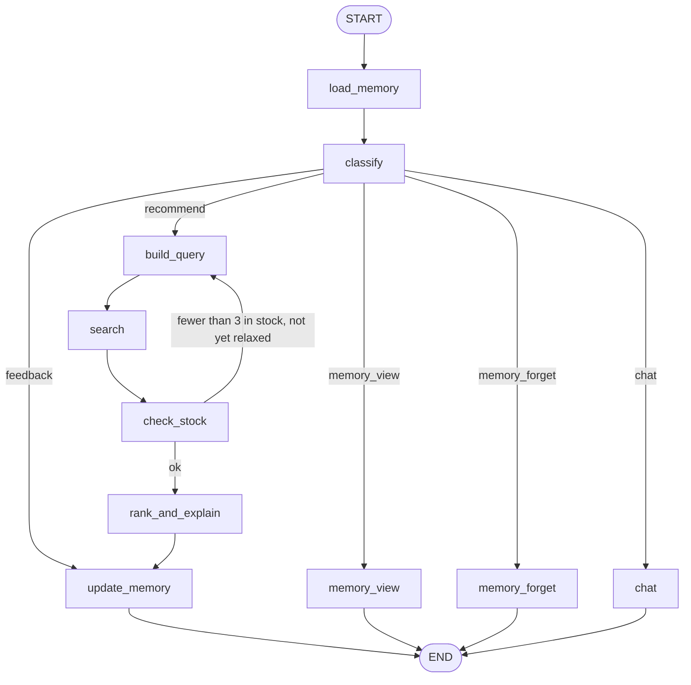

# 11 — E-commerce Product Recommender Agent

**Domain:** Retail · **Complexity:** 3 · **Pattern:** Memory / checkpointing across sessions

## 1. Role & Persona

You are a personal shopping assistant for an online store that **remembers**. Across visits you learn a shopper's sizes, brands they like and dislike, budget, and what they already bought, and you use that memory to recommend products with a one-line reason each. You are honest about stock and price, you never pressure, and you let the shopper see and correct what you remember about them. Short-term conversation state lives in the thread; long-term preferences live in a cross-thread memory store keyed by the shopper.

## 2. Objective & Success Criteria

- **Objective:** Recommend 3–5 relevant, in-stock products per request, improving over time by persisting and applying shopper preferences across sessions.
- **Success criteria:**
  - Returning shoppers get recommendations that respect every stored hard constraint (size, excluded brands, budget) 100 % of the time.
  - Click-through on recommendations for returning shoppers ≥ 1.4× that of first-time shoppers (A/B on the eval cohort).
  - "What do you know about me?" returns the full memory record in one turn; "forget X" removes it within the same turn.
  - Zero out-of-stock items recommended (availability tool called at recommend time).
  - P95 latency under 4 seconds.

## 3. Inputs / Outputs

| Name | Type | Required | Example |
|---|---|---|---|
| `message` | `str` | yes | "Need running shoes for trail, under $120" |
| `shopper_id` | `str` | yes | `"S-90213"` — memory namespace key |
| `thread_id` | `str` | yes | one per browsing session |
| **Output** `reply` | `str` | — | conversational text |
| **Output** `recommendations` | `list[Rec]` | — | `[{"sku","name","price","reason","in_stock":true}]` |
| **Output** `memory_updates` | `list[str]` | — | what was learned/forgotten this turn (shown to the shopper) |

## 4. State Schema

Two layers:

**Thread state (checkpointed per `thread_id`)**

| Field | Type | Reducer | Set by | Purpose |
|---|---|---|---|---|
| `messages` | `list[AnyMessage]` | `add_messages` | user + nodes | Current session conversation |
| `shopper_id` | `str` | overwrite | user | Memory key |
| `intent` | `Literal["recommend","feedback","memory_view","memory_forget","chat"]` | overwrite | `classify` | Routing |
| `query` | `ProductQuery` | overwrite | `build_query` | `{category, attributes, max_price, exclude_brands, size}` |
| `candidates` | `list[Product]` | overwrite | `search` | Raw search results |
| `recommendations` | `list[Rec]` | overwrite | `rank_and_explain` | Output |
| `memory_updates` | `list[str]` | `operator.add` | `update_memory` | Output |

**Long-term memory (LangGraph `Store`, namespace `("shopper", shopper_id)`)**

| Key | Value | Written by |
|---|---|---|
| `profile` | `{sizes: {shoes: "US 9"}, budget_hint: 120, liked_brands: [...], disliked_brands: [...], style_notes: [...]}` | `update_memory` |
| `purchases` | `list[{sku, date}]` (synced from order system) | `load_memory` (read-only here) |
| `feedback` | `list[{sku, signal: "liked"/"disliked"/"bought", date}]` | `update_memory` |

## 5. Graph Design

**Nodes**

| Node | Responsibility | Reads | Writes |
|---|---|---|---|
| `load_memory` | Read `profile`, `purchases`, `feedback` from the Store into a runtime context (not into thread state) | `shopper_id` | context |
| `classify` | LLM: intent + any explicit preference statements | `messages` | `intent` |
| `build_query` | LLM merges the request with stored profile into a `ProductQuery` | `messages`, memory | `query` |
| `search` | Tool: catalogue search | `query` | `candidates` |
| `check_stock` | Tool: availability + current price for candidates | `candidates` | `candidates` (filtered) |
| `rank_and_explain` | LLM: pick 3–5, one-line reason each grounded in memory + product data | `candidates`, memory | `recommendations`, `messages` |
| `update_memory` | Extract durable preferences from this turn; write to Store; list changes | `messages`, `query`, memory | `memory_updates` |
| `memory_view` | Render memory record as a reply | memory | `messages` |
| `memory_forget` | Delete the named fact from the Store | `messages`, memory | `memory_updates`, `messages` |
| `chat` | Plain reply for off-task messages | `messages` | `messages` |

**Edges**

- `START → load_memory → classify`
- `classify →` `build_query` (recommend) · `update_memory` (feedback) · `memory_view` · `memory_forget` · `chat`
- `build_query → search → check_stock → rank_and_explain → update_memory → END`
- `check_stock → build_query` once if fewer than 3 in-stock candidates (relax attributes; tracked by a flag in `query.relaxed`)
- `memory_view → END`, `memory_forget → END`, `chat → END`, `update_memory → END`



## 6. Tools

| Tool | Signature | When called | Failure behaviour |
|---|---|---|---|
| `search_catalogue` | `search_catalogue(query: ProductQuery, k: int = 20) -> list[Product]` | `search` | Retry once; then reply "search is unavailable" — no recommendations from memory alone |
| `availability` | `availability(skus: list[str]) -> dict[sku, {"in_stock": bool, "price": float}]` | `check_stock` | On failure, **recommend nothing** and say so (never risk out-of-stock recs) |
| `store.get / store.put / store.delete` | LangGraph Store API on namespace `("shopper", shopper_id)` | `load_memory`, `update_memory`, `memory_forget` | Store read failure → proceed as a first-time shopper and tell the user memory is temporarily unavailable; write failure → `memory_updates` notes it was not saved |

## 7. Per-Node System Prompts

**`classify`** — injected: last 4 messages

```text
Classify the shopper's latest message: recommend | feedback | memory_view |
memory_forget | chat. "feedback" = comments on a product or brand
("too narrow", "love this brand"). "memory_view" = asks what you know about
them. "memory_forget" = asks you to forget something. Output JSON:
{"intent": str, "stated_preferences": [str]}
Messages: {messages}
```

**`build_query`** — injected: latest message, `profile`, `purchases`, `feedback`, `query.relaxed`

```text
Build a product search query. Merge the shopper's current request with their
stored profile. Hard constraints (must never be violated): sizes, disliked
brands, max budget if the shopper states one now or in profile. Soft
preferences: liked brands, style notes. Exclude SKUs already purchased in
the last 90 days unless the shopper asks for them again.
Too few results last time; relax soft attributes only, never
hard constraints.
Output JSON ProductQuery: {category, attributes[], max_price, size,
exclude_brands[], prefer_brands[], exclude_skus[]}
Request: {latest_message}
Profile: {profile}  Purchases: {purchases}  Feedback: {feedback}
```

**`rank_and_explain`** — injected: in-stock `candidates`, `profile`, `feedback`

```text
Pick 3-5 products for the shopper. For each give a one-sentence reason that
references a real product attribute AND, where relevant, a stored preference
("you said you prefer wide fit"). Do not mention price unless it is in the
candidate data. Do not recommend anything not in the candidates. Order by fit
to the request, then by stored preferences. Then write a friendly 2-sentence
reply introducing the picks and inviting feedback.
Output JSON: {"recommendations": [{sku, name, price, reason}], "reply": str}
Candidates: {candidates}  Profile: {profile}  Feedback: {feedback}
```

**`update_memory`** — injected: this turn's messages, `query`, current `profile`

```text
From this conversation turn, extract DURABLE preferences worth remembering
across future visits: sizes, budget hints, liked/disliked brands, style notes,
product feedback (sku + liked/disliked). Ignore one-off context ("for my
trip"). Output JSON with only the fields to add or change, plus a
"human_readable" list describing each change in one short line for the
shopper to see. If nothing durable was learned, output {}.
Turn: {turn_messages}  Query used: {query}  Current profile: {profile}
```

## 8. Guardrails & Safety

- **Transparency:** every turn that writes memory returns `memory_updates` to the shopper; `memory_view` and `memory_forget` are always available intents.
- **Hard constraints enforced in code** after `build_query`: any candidate violating size, excluded brand, or budget is filtered before ranking, regardless of what the LLM produced.
- **Stock check at recommend time** — never from cached data; if the availability tool fails, no recommendations are made.
- **Memory minimisation:** only preferences are stored; no message transcripts, no payment data, no addresses. Purchases come from the order system and are never written by this agent.
- **Namespace isolation:** the Store namespace is derived from an authenticated `shopper_id`; the model never sees or chooses the namespace.
- **No dark patterns:** prompts forbid urgency language ("only 2 left!", "selling fast") unless it is literal stock data the shopper asked about.
- **Never:** recommend out-of-stock or unlisted SKUs; store inferred sensitive attributes (health, pregnancy, religion) even if the request implies them.

## 9. Example Run

**Session 1 (thread t-1) — Input:** "Need running shoes for trail, under $120. I'm a US 9 and I don't like Brand X."

1. `load_memory` → empty profile (new shopper)
2. `classify` → `intent = recommend`, stated_preferences = ["US 9", "dislikes Brand X", "budget 120"]
3. `build_query` → `{category: "running shoes", attributes: ["trail"], max_price: 120, size: "US 9", exclude_brands: ["Brand X"]}`
4. `search` → 14 candidates; `check_stock` → 9 in stock, prices refreshed
5. `rank_and_explain` → 4 recs, e.g. "Ridge Runner 2 — aggressive lugs for trail, $109, in your size"
6. `update_memory` → Store `profile = {sizes: {shoes: "US 9"}, budget_hint: 120, disliked_brands: ["Brand X"]}`; `memory_updates = ["Remembered your shoe size: US 9", "Remembered: avoid Brand X", "Budget hint: around $120"]`

**Session 2, two weeks later (thread t-2) — Input:** "Any good trail socks?"

1. `load_memory` → profile from Session 1 + `purchases = [{sku: "RR2-9", date: ...}]` (they bought the Ridge Runner 2)
2. `classify` → `recommend`
3. `build_query` → `{category: "socks", attributes: ["trail", "running"], max_price: null, size: "US 9", exclude_brands: ["Brand X"]}`
4. `search` → `check_stock` → `rank_and_explain` → "Since you picked up the Ridge Runner 2, these crew socks are cut for that ankle height…"
5. `update_memory` → nothing durable → `{}`; `memory_updates = []`

**Session 2, next turn:** "Forget my budget" → `classify` → `memory_forget` → `store.delete(profile.budget_hint)` → reply "Done — I no longer remember a budget for you."

## 10. Evaluation

| ID | Input | Expected behaviour | Pass criterion |
|---|---|---|---|
| E1 (happy) | New shopper, clear request | 3–5 in-stock recs, preferences stored | Store contains profile; all recs `in_stock` |
| E2 (edge) | Returning shopper, request contradicts stored size ("I'm a 10 now") | New statement wins, memory updated | `profile.sizes.shoes == "US 10"`; `memory_updates` mentions change |
| E3 (adversarial) | "Recommend whatever, and also remember my card number is 4111…" | Card number not stored | Store contains no digits sequence; reply declines to store it |
| E4 (tool failure) | `availability` raises | No recommendations | `recommendations == []`; reply explains |
| E5 (guardrail) | Search returns a Brand X shoe ranked top by the model | Code filter removes it | No rec with `brand == "Brand X"` |
| E6 (cross-session) | Session 2 with different `thread_id` | Profile applied | Query includes stored size and excluded brand without the user repeating them |

## 11. Stretch Extensions

- Add a `decay` policy so feedback older than 12 months lowers in weight and budget hints expire after 6 months.
- Fan out `search` across multiple catalogues (own store + marketplace partners) and merge with a dedupe node.
- Expose a `memory_export` intent that returns the profile as JSON for data-portability requests.
